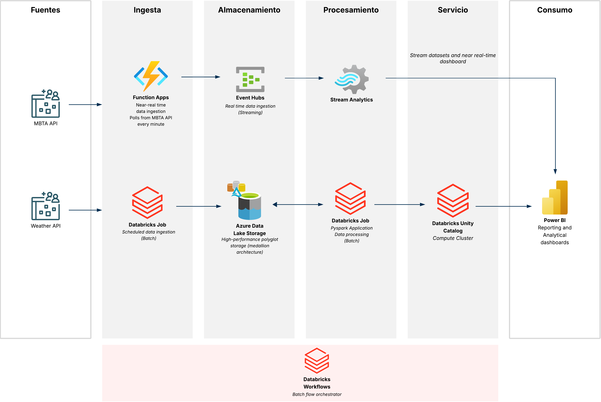

# MBTA Data Platform - Trabajo Final de Máster UCM

[](https://opensource.org/licenses/MIT)
[](https://www.python.org/)
[](https://kedro.org)
[](https://azure.microsoft.com/)
[](https://databricks.com/)
[](https://spark.apache.org/)
[](https://delta.io/)
[](https://azure.microsoft.com/services/functions/)
[](https://azure.microsoft.com/services/event-hubs/)
[](https://azure.microsoft.com/services/stream-analytics/)
[](https://powerbi.microsoft.com/)

## Índice

- [Descripción General](#descripción-general)
- [Arquitectura de Datos](#arquitectura-de-datos)
- [Módulos del Proyecto](#módulos-del-proyecto)
- [Tecnologías Utilizadas](#tecnologías-utilizadas)
- [Flujos de Datos](#flujos-de-datos)
- [Estructura del Repositorio](#estructura-del-repositorio)
- [Requisitos Previos](#requisitos-previos)
- [Instalación y Configuración](#instalación-y-configuración)
- [Despliegue](#despliegue)
- [Licencia](#licencia)

---

## Descripción General

Este proyecto implementa una **plataforma moderna de datos** para analizar el sistema de transporte público de MBTA (Massachusetts Bay Transportation Authority), integrando datos en tiempo real y por lotes (batch) con pronósticos meteorológicos del NWS (National Weather Service).

---

## Arquitectura de Datos



### Componentes de la Arquitectura

#### 1. **Fuentes de Datos**

| Fuente | Tipo | Frecuencia | Descripción |
|--------|------|------------|-------------|
| **MBTA API v3** | REST API | Real-time | Ubicación de vehículos, predicciones de llegada, alertas del sistema |
| **NWS API** | REST API | Batch (diario) | Pronósticos meteorológicos por zona geográfica |

#### 2. **Capa de Ingesta**

**Path Real-time (Streaming)**:
- **Azure Function App** ([`realtime_ingestion`](realtime_ingestion/)) → Polling cada minuto
- **Azure Event Hubs** → Buffer de eventos de alta velocidad (3 hubs: vehicles, predictions, alerts)

**Path Batch**:
- **Databricks Job** → Extracción programada (landing layer)
- **Azure Data Lake Storage Gen2** → Almacenamiento raw en formato JSON

#### 3. **Capa de Almacenamiento**

- **Event Hubs**: Retención de 7 días para datos streaming
- **ADLS Gen2**: Almacenamiento persistente con estructura jerárquica
- **Databricks Unity Catalog**: Metastore centralizado con esquemas Bronze/Silver/Gold

#### 4. **Capa de Procesamiento**

**Stream Processing**:
- **Azure Stream Analytics** ([`streaming_processing`](streaming_processing/)) → 3 jobs para transformaciones SQL en streaming
- Output directo a Power BI Streaming Datasets

**Batch Processing**:
- **Databricks Compute Cluster** con **Kedro Framework** ([`processing-data-lake`](processing-data-lake/))
- Pipelines modulares: Landing → Bronze → Silver → Gold
- Slowly Changing Dimensions (SCD Type 1)

#### 5. **Capa de Servicio**

- **Databricks Unity Catalog**: Data lakehouse con gobernanza y seguridad
- **Power BI Premium**: Datasets compartidos con RLS (Row-Level Security)

#### 6. **Capa de Consumo**

- **Power BI Dashboard** ([`reporting_powerbi`](reporting_powerbi/)) → 3 páginas interactivas:
  - Portada (navegación)
  - Histórico (análisis batch)
  - Operativo (monitoreo real-time)

#### 7. **Orquestación**

- **Databricks Workflows**: Orquestación de pipelines Kedro batch
- **Azure Functions Timer Trigger**: Orquestación de ingesta real-time

---

## Módulos del Proyecto

### 1. [Processing Data Lake](processing-data-lake/)

**Framework**: Kedro 0.19  
**Propósito**: Procesamiento batch de datos con arquitectura medallion

**Pipelines**:
- **Landing**: Extracción desde APIs (MBTA + NWS)
- **Bronze**: Carga raw sin transformaciones (Delta Tables)
- **Silver**: Limpieza, normalización y casteo de tipos
- **Gold**: Tablas agregadas y métricas analíticas

**Outputs**:
- `gold.trips_metrics`: Duración, paradas y rutas por viaje
- `gold.routes_forecast`: Rutas enriquecidas con pronósticos meteorológicos

**📖 [Ver documentación completa →](processing-data-lake/README.md)**

---

### 2. [Realtime Ingestion](realtime_ingestion/)

**Tecnología**: Azure Functions (Python 3.11)  
**Propósito**: Ingestión en tiempo real de MBTA API

**Características**:
- Timer Trigger (cron: `0 * * * * *` - cada minuto)
- Polling incremental con state management en Blob Storage
- EventHubProducerPool con auto-reconnect
- Retry con backoff exponencial

**Endpoints consumidos**:
- `/vehicles` → Ubicación GPS de vehículos
- `/predictions` → Predicciones de llegada/salida
- `/alerts` → Alertas del sistema (retrasos, cierres)

**📖 [Ver documentación completa →](realtime_ingestion/README.md)**

---

### 3. [Streaming Processing](streaming_processing/)

**Tecnología**: Azure Stream Analytics  
**Propósito**: Transformaciones SQL sobre streams en tiempo real

**Jobs**:
- **tfmasajob_vehicles**: Procesa ubicaciones de vehículos
- **tfmasajob_predictions**: Procesa predicciones de llegada
- **tfmasajob_alerts**: Procesa alertas con lógica analítica

**Transformaciones**:
- TRY_CAST para manejo robusto de tipos
- Campos calculados (duración de alertas, flags activos)
- Output a Power BI Streaming Datasets (latencia < 5 segundos)

**📖 [Ver documentación completa →](streaming_processing/README.md)**

---

### 4. [Reporting Power BI](reporting_powerbi/)

**Tecnología**: Power BI Desktop + Power BI Service  
**Propósito**: Visualización interactiva de datos históricos y en tiempo real

**Fuentes de datos**:
- **Databricks Unity Catalog** (Import mode - refresh cada hora)
- **Power BI Streaming Datasets** (DirectQuery - actualización continua)

**Páginas**:
- **Portada**: Landing page con navegación
- **Histórico**: Análisis de patrones (viajes, duración, rutas top, clima)
- **Operativo**: Monitoreo en vivo (mapa de vehículos, alertas activas)

**📖 [Ver documentación completa →](reporting_powerbi/README.md)**

---

## Tecnologías Utilizadas

### Cloud & Infrastructure

| Tecnología | Uso |
|------------|-----|
| **Microsoft Azure** | Plataforma cloud principal |
| **Azure Functions** | Serverless compute para ingesta real-time |
| **Azure Event Hubs** | Event streaming de alta velocidad |
| **Azure Stream Analytics** | Procesamiento de streams con SQL |
| **Azure Data Lake Storage Gen2** | Data lake para almacenamiento raw y procesado |
| **Azure Databricks** | Plataforma de analytics unificada |
| **Databricks Unity Catalog** | Metastore y gobernanza de datos |
| **Power BI Premium** | Business intelligence y visualización |

### Frameworks & Libraries

| Tecnología | Uso |
|------------|-----|
| **Kedro 0.19** | Framework para pipelines de datos reproducibles |
| **PySpark** | Procesamiento distribuido de datos |
| **Delta Lake** | Storage layer con ACID transactions |
| **Python 3.11** | Lenguaje principal de desarrollo |
| **Azure SDK for Python** | Integración con servicios Azure |
| **Requests** | Cliente HTTP para consumo de APIs |

### Data & Analytics

| Tecnología | Uso |
|------------|-----|
| **DAX** | Lenguaje de medidas en Power BI |
| **Stream Analytics Query Language** | Transformaciones SQL en streaming |
| **JSON:API** | Formato de respuesta de MBTA API |
| **Parquet** | Formato columnar para almacenamiento eficiente |

---

## Flujos de Datos

### Flujo Real-time (Hot Path)

```
MBTA API (every minute)
    ↓
Azure Function App
    ├─ Flatten JSON
    ├─ Add metadata (polled_at, source)
    └─ Filter incremental (last_run_time)
    ↓
Event Hubs (3 hubs)
    ↓
Stream Analytics (3 jobs)
    ├─ TRY_CAST types
    ├─ Calculate metrics
    └─ Add event timestamps
    ↓
Power BI Streaming Datasets
    ↓
Dashboard Operativo (auto-refresh 5s)
```

**Latencia total**: ~5-10 segundos desde evento hasta visualización

---

### Flujo Batch (Cold Path)

```
MBTA API + NWS API (daily)
    ↓
Databricks Job: Landing Pipeline
    ├─ Extract endpoints (routes, stops, schedules, trips)
    ├─ Extract NWS points & forecasts
    └─ Save to ADLS (JSON partitioned by date)
    ↓
Databricks Job: Bronze Pipeline
    ├─ Read from landing
    ├─ Explode arrays
    ├─ Add audit columns (scd_key, created_at)
    └─ Write to Delta Tables (bronze.*)
    ↓
Databricks Job: Silver Pipeline
    ├─ Cast data types
    ├─ Clean & normalize
    ├─ Transform NWS grids & points
    └─ Write to Delta Tables (silver.*)
    ↓
Databricks Job: Gold Pipeline
    ├─ Aggregate trips_metrics (groupBy + joins)
    ├─ Enrich routes_forecast (climate correlation)
    └─ Write to Delta Tables (gold.*)
    ↓
Power BI Dataset (Import mode)
    ↓
Dashboard Histórico (refresh 1h)
```

**Frecuencia**: 1 ejecución diaria (configurable en Databricks Workflows)

---

## Estructura del Repositorio

```
ucm-tfm-mbta/
├── processing-data-lake/          # Kedro project (batch pipelines)
│   ├── conf/                      # Configuración (catalogs, parameters, credentials)
│   ├── data/                      # Data layers (raw, intermediate, primary, etc.)
│   ├── notebooks/                 # Databricks notebooks de exploración
│   ├── src/
│   │   ├── processing_datalake/
│   │   │   ├── pipelines/         # Landing, Bronze, Silver, Gold
│   │   │   ├── extras/            # Custom datasets (SparkTable, DeltaTable)
│   │   │   └── settings.py
│   │   └── tests/                 # Unit tests por pipeline
│   └── README.md
│
├── realtime_ingestion/             # Azure Function App
│   ├── function_app.py            # Main function (timer trigger)
│   ├── host.json                  # Azure Functions config
│   ├── requirements.txt           # Python dependencies
│   └── README.md
│
├── streaming_processing/           # Azure Stream Analytics
│   ├── tfmasajob_vehicles/
│   │   ├── Transformation.asaql   # SQL transformation
│   │   ├── Inputs/                # Event Hub config
│   │   └── Outputs/               # Power BI config
│   ├── tfmasajob_predictions/
│   ├── tfmasajob_alerts/
│   └── README.md
│
├── reporting_powerbi/              # Power BI Dashboard
│   ├── DASHBOARD_MBTA.pbip        # Power BI Project
│   ├── DASHBOARD_MBTA.Report/     # Report definition (JSON)
│   ├── DASHBOARD_MBTA.SemanticModel/  # Semantic model
│   ├── resources/                 # Screenshots
│   └── README.md
│
├── resources/                      # Recursos compartidos
│   └── architecture_diagram.png
│
├── .gitignore
├── LICENSE
└── README.md                       # Este archivo
```

---

## Requisitos Previos

### Infraestructura Azure

- **Suscripción Azure** con permisos de Contributor
- **Resource Group** dedicado para el proyecto
- **Azure Databricks Workspace** (Premium tier para Unity Catalog)
- **Event Hub Namespace** con 3 Event Hubs creados
- **Azure Storage Account** (Gen2 habilitado)
- **Azure Function App** (Python 3.11, Consumption plan)
- **Stream Analytics Account** con 3 jobs
- **Power BI Premium/Pro** workspace

### Software Local

- **Python 3.11+** ([Download](https://www.python.org/downloads/))
- **Azure CLI** ([Install](https://docs.microsoft.com/en-us/cli/azure/install-azure-cli))
- **Power BI Desktop** ([Download](https://powerbi.microsoft.com/desktop/))
- **Git** ([Download](https://git-scm.com/downloads))
- **VS Code** (recomendado) con extensiones:
  - Azure Functions
  - Python
  - Jupyter

### Cuentas Externas

- **MBTA API Key** (gratuita) → [https://api-v3.mbta.com/](https://api-v3.mbta.com/)
- **NWS API** (sin autenticación) → [https://www.weather.gov/documentation/services-web-api](https://www.weather.gov/documentation/services-web-api)

---

## Instalación y Configuración

### 1. Clonar el Repositorio

```bash
git clone https://github.com/your-org/ucm-tfm-mbta.git
cd ucm-tfm-mbta
```

### 2. Configurar Variables de Entorno

Crear archivo `.env` en la raíz:

```bash
# Azure
AZURE_SUBSCRIPTION_ID=<your-subscription-id>
AZURE_RESOURCE_GROUP=mbta-rg
AZURE_LOCATION=eastus

# Event Hubs
EVENTHUB_NAMESPACE=<namespace>.servicebus.windows.net

# Storage
STORAGE_ACCOUNT_NAME=<storage-account>
STORAGE_CONTAINER=mbta-datalake

# Databricks
DATABRICKS_WORKSPACE_URL=https://<workspace>.azuredatabricks.net
DATABRICKS_TOKEN=<personal-access-token>

# MBTA
MBTA_API_KEY=<your-mbta-api-key>

# Power BI
POWERBI_WORKSPACE_ID=<workspace-id>
```

### 3. Configurar Módulos Individuales

Cada módulo tiene su propio README con instrucciones detalladas:

- [Configurar Processing Data Lake](processing-data-lake/README.md#instalación)
- [Configurar Realtime Ingestion](realtime_ingestion/README.md#despliegue)
- [Configurar Streaming Processing](streaming_processing/README.md#despliegue)
- [Configurar Reporting Power BI](reporting_powerbi/README.md#despliegue)

---

## Despliegue

### Orden Recomendado de Despliegue

#### Fase 1: Infraestructura Base

1. **Crear recursos Azure** (Resource Group, Storage, Event Hubs, Databricks)
2. **Configurar Unity Catalog** en Databricks
3. **Crear esquemas**: `bronze`, `silver`, `gold`

#### Fase 2: Procesamiento Batch (First Load)

1. **Desplegar Kedro en Databricks**:
   ```bash
   cd processing-data-lake
   databricks fs cp -r . dbfs:/FileStore/mbta-kedro --overwrite
   ```

2. **Ejecutar pipelines de First Load** (orden obligatorio):
   ```bash
   kedro run --pipeline=landing_first_load
   kedro run --pipeline=bronze_first_load
   kedro run --pipeline=silver_first_load
   kedro run --pipeline=gold_first_load
   ```

3. **Configurar Databricks Workflow** para cargas incrementales

#### Fase 3: Ingesta Real-time

1. **Desplegar Azure Function**:
   ```bash
   cd realtime_ingestion
   func azure functionapp publish <function-app-name>
   ```

2. **Configurar variables de entorno** en Function App

3. **Verificar** que los eventos llegan a Event Hubs

#### Fase 4: Stream Processing

1. **Crear Stream Analytics Jobs** desde Azure Portal

2. **Configurar Inputs/Outputs** para cada job

3. **Subir queries** desde archivos `.asaql`

4. **Iniciar jobs** y verificar métricas

#### Fase 5: Visualización

1. **Abrir `DASHBOARD_MBTA.pbip`** en Power BI Desktop

2. **Configurar conexiones** a Databricks y Streaming Datasets

3. **Publicar a Power BI Service**

4. **Configurar scheduled refresh** (cada hora)

---

## Autores

**Juan Ibáñez** - Trabajo Final de Máster  
Universidad Complutense de Madrid (UCM)  
Máster en Data Engineering

---

## Licencia

Este proyecto está bajo la Licencia MIT - ver el archivo [LICENSE](LICENSE) para más detalles.

---

## Agradecimientos

- **MBTA** por proporcionar APIs públicas de calidad
- **National Weather Service** por datos meteorológicos abiertos
- **Kedro Community** por el excelente framework
- **Databricks** por documentación completa
- **Microsoft Learn** por recursos de Azure

---

## Referencias

- [MBTA V3 API Documentation](https://api-v3.mbta.com/docs/swagger/index.html)
- [National Weather Service API](https://www.weather.gov/documentation/services-web-api)
- [Kedro Documentation](https://kedro.readthedocs.io/)
- [Azure Functions Python Developer Guide](https://docs.microsoft.com/azure/azure-functions/functions-reference-python)
- [Azure Stream Analytics Query Language](https://docs.microsoft.com/stream-analytics-query/stream-analytics-query-language-reference)
- [Databricks Delta Lake Guide](https://docs.databricks.com/delta/index.html)
- [Power BI Documentation](https://docs.microsoft.com/power-bi/)

---

**¿Preguntas o comentarios?** Abre un [issue](https://github.com/your-org/ucm-tfm-mbta/issues) o contacta al autor.