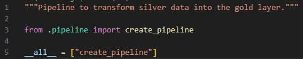
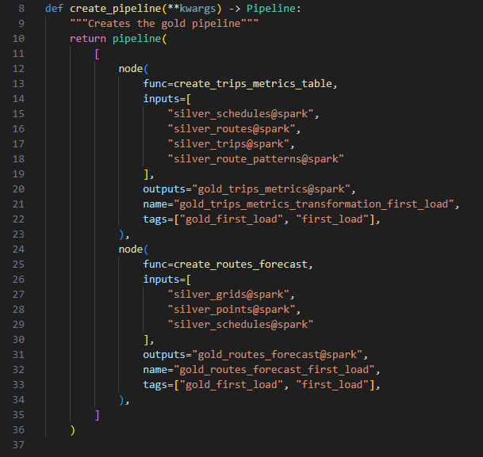
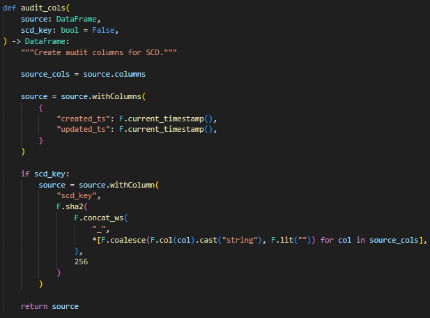

# Processing Data Lake - TFM MBTA

[](https://kedro.org)

## Tabla de Contenidos

- [Introducción](#introducción)
- [¿Qué es Kedro?](#qué-es-kedro)
-  [Arquitectura del Código](#arquitectura-del-código)
- [Módulo de Utilidades](#modulo-de-utilidades)
- [Pipelines y Nodos](#pipelines-y-nodos)
  - [Pipeline Landing](#pipeline-landing)
  - [Pipeline Bronze](#pipeline-bronze)
  - [Pipeline Silver](#pipeline-silver)
  - [Pipeline Gold](#pipeline-gold)
- [Módulo de Tests](#modulo-de-tests)

---

## Introducción

Este módulo implementa el procesamiento de datos del proyecto TFM MBTA (Massachusetts Bay Transportation Authority) utilizando **Kedro** como framework principal. El proyecto integra datos de transporte público de MBTA con pronósticos meteorológicos de NWS (National Weather Service) para crear un data lakehouse analítico en Azure Databricks.

## ¿Qué es Kedro?

Kedro es un framework utilizado principalmente para replicar de forma modular los proyectos de datos. Este fue creado por **Quantum Black** (una subdivisión de McKinsey) precisamente para abstraer los proyectos de datos de manera que todo (tanto ingeniería como ciencia de datos) se encuentren en un solo ambiente.

Este se encuentra escrito en Python y utiliza los archivos de extensión YAML para el catálogo, los parámetros y las credenciales. Es un proyecto de código abierto que aún se encuentra en mejora y facilita mucho los ciclos de lectura y escritura en entornos productivos.

## Arquitectura del Código


El framework utilizado es capaz de abstraer la lectura y escritura de los datos y sus parámetros con un concepto llamado **Catálogo.**


## Arquitectura: catálogo y parámetros.

El catálogo funciona como nuestro meta almacén de datos donde se registra la información necesaria para poder leer y escribir los datasets. También en este se registran los parámetros para hacer los pipelines menos dependientes a ajustes de código y más parametrizables.

Dentro del cátalogo, se registran los **Datasets** como se mencionaba anteriormente, estos datasets dependen mucho de su origen. Estos pueden ser desde tipo JSON a tipo Pickle o Spark. En cualquier caso, para registrar cualquier set de datos, es necesario indicar que tipo de dataset es, y de acuerdo con la API a utilizar (YAML API o Python API) se deben indicar las respectivas propiedades de cada uno.

Para el caso del proyecto, se crearon dos datasets propietarios, esto con el objetivo de facilitar la lectura y escritura en databricks, al ser Kedro un código open source, permite crear datasets propietarios que se registren y hablen con el proyecto. Estos son el **SparkTableDataset** y el **DeltaTableDataset**, ambos heredan las propiedades base de la clase de **AbstractDataset.**

****

Como se observa para ambos casos, se crearon dos atributos que son obligatorios: _directory_ y _table._ Siendo el directorio, la ruta o esquema donde se encuentra la tabla, y siendo table el nombre de la tabla. Este dataset, hace un parsing sobre el atributo de _directory_ y si detecta backslash, asume que es un archivo, pero si detecta un punto y la separación, sabe que se trata de una base de datos o algún hive metastore. De acuerdo con estos dos atributos, es capaz de identificar si se trata de archivos o no. De esta manera se ven los datasets en YAML:


Por otro lado, los parámetros, son archivos yaml que se registran dentro de la carpeta de parameters, estos son serializados por el paquete de yaml como un diccionario. Estos archivos son utilizados precisamente para parametrizar los pipelines y reducir los cambios a lógica de código.

## Arquitectura: pipeline y nodos.


Otro de los objetos principales de Kedro son los pipelines y los nodos. Los nodos en Kedro hacen la función de contener toda la lógica para el tratamiento de los datos, y los pipelines se encarga de orquestarlos y establecer las relaciones entre ellos.

Un pipeline se crea de la siguiente manera y se instancia en el archivo \_\_init\_\_.py.






La función para crear el pipeline, se comprende de un listado de nodos. Estos referencian las funciones creadas en la carpeta de nodes del respectivo pipeline, adicionalmente, en el archivo **\_\_init\_\_.py** se importa la función para esta ser tenida en cuenta por kedro como pipeline.

# Modulo de utilidades

Con el objetivo de tener funciones que puedan ser reutilizables a través de todo el proyecto, se creó un módulo de utilidades, en este se plasmó la lógica principal para crear las columnas de auditoría y para realizar las escrituras y operaciones con las tablas Delta.

## Módulo utils: Funciones de auditoría.

Para agregar el nombre del archivo en el caso de la capa de bronce se utiliza esta función:


Por otro lado, para agregar las columnas de auditoría se utiliza esta función:



En el caso de esta función, se agrega un parámetro adicional que es capaz de crear una llave única con el algoritmo de sha2 con 256 bits con las columnas del dataset. Este es posteriormente utilizado para la escritura en las tablas manejadas como dimensiones de tipo 1.

## Modulo utils: Funciones para DeltaTables.

Como se mencionaba anteriormente, se crearon dos funciones para ejecutar las operaciones necesarias con las tablas Delta.

Para escribir las tablas que se van a manejar como dimensiones de tipo 1 se creó una función que fuese capaz de ejecutar un upsert. Los upserts van siempre a actualizar los registros nuevos y a modificar los anteriores.


En esta función que recibe como parámetros la tabla a transformar, la tabla delta registrada en el catálogo, y las llaves para tener en cuenta al construir el merge, creando así el upsert.

Por otra parte, el siguiente bloque de código aprovecha una propiedad de las tablas de tipo Delta llamada **replaceWhere,** la cual sirve precisamente para reemplazar por un predicado, la información que cumpla con esa condición.


El módulo de utils toma todas estas funciones y las aprovecha a través de todos los pipelines.

# Pipelines y nodos.

En esta sección se describe el funcionamiento de los pipelines y los nodos para el procesamiento de los datos de la API de MBTA (Massachusetts Bay Transportation Authority) y la API de NWS (National Weather Service). Los pipelines están alineados a la arquitectura del proyecto:

*   **Landing**: Extrae datos raw de las APIs.
*   **Bronze**: Carga inicial sin transformaciones significativas, solo explotando los datos para mantener el formato tabular.
*   **Silver**: Se realiza la limpieza y normalización de los datos.
*   **Gold**: Tablas agregadas y métricas destinadas al análisis y consumirse en los tableros.

Todas las capas cuentan con dos tipos de pipelines:

*   **First Load**: Realiza la carga inicial de datos, crea las tablas en los esquemas con los datos iniciales su sentencia principal es **CREATE**.
*   **Current Load**: Realiza las cargas incrementales, sus sentencias principales son **MERGE, UPDATE**.

En esta sección se busca más que todo explicar el funcionamiento del proyecto. Todo el código se puede evidenciar en el repositorio.

## Pipeline Landing

Este flujo de datos es el responsable de extraer los datos brutos desde las fuentes externas y almacenarlos en la capa landing del data lakehouse, particionado por fecha y ejecución. No realiza transformaciones, sólo descarga y persiste los JSON originales.

### Flujo de ejecución

1. **extract_last_timestamp**
   - Genera timestamp actual (formato: `YYYYMMDDHHmmss`)
   - **Salida**: `landing_last_execution@json = {"last_ts": "20260212143000"}`

2. **extract_mbta_endpoints**
   - Descarga endpoints estáticos de MBTA (rutas, patrones, paradas, etc.)
   - **Entrada**: params + landing_last_execution

3. **extract_mbta_schedules**
   - Itera sobre paradas, descarga horarios de MBTA por cada una
   - **Entrada**: paradas base + último timestamp

4. **extract_mbta_trips**
   - Itera sobre paradas, descarga viajes de MBTA por cada una
   - **Entrada**: paradas base + último timestamp

5. **extract_nws_points**
   - Extrae puntos de pronóstico NWS (lat/lon) para cada parada
   - **Entrada**: paradas MBTA + último timestamp

6. **extract_nws_grid_forecast**
   - Descarga pronósticos por grid NWS (temperatura, precipitación, etc.)
   - **Entrada**: puntos NWS extraídos + último timestamp

### Descripción de nodos

A continuación, se describen de forma general los nodos que se encuentran definidos en el pipeline:

#### Nodo: extract_last_timestamp

**Función**: `last_ts()`

- Genera un timestamp con formato `YYYYMMDDHHmmss` (ejemplo: `20260212143000`)
- Este timestamp se usa como identificador único de ejecución y para particionar archivos
- **Salida**: JSON con estructura `{"last_ts": "20260212143000"}`

#### Nodo: extract_mbta_endpoints

**Función**: `extract_mbta_endpoint(params, last_exec)`

- **Entrada**: Parámetros con lista de endpoints estáticos de MBTA
- **Proceso**:
  1. Obtiene API key desde credenciales
  2. Itera sobre endpoints declarados (rutas, patrones, paradas, etc.)
  3. Realiza GET request a MBTA API con header `x-api-key`
  4. Guarda respuesta JSON en dataset del catálogo
  5. Maneja rutas con formato dinámico: `{last_ts}/{year}/{month}/{day}/`
- **Salida**: JSON con datos de endpoints procesados

#### Nodo: extract_mbta_schedules y extract_mbta_trips

**Función**: `extract_mbta_filter_endpoints(params, last_exec, endpoints)`

- **Entrada**: Dataset de paradas base extraído previamente
- **Proceso**:
  1. Carga IDs de paradas desde dataset base
  2. Construye lista de metadatos: `{url, id, timestamp, catalog_dataset}`
  3. Dispara **extracción asíncrona concurrente**:
     - Semáforo de 10 requests simultáneos (para no sobrecargar API)
     - Itera sobre cada parada y realiza GET request
     - Guarda respuesta en dataset individualizado
  4. Usa `asyncio` + `aiohttp` para concurrencia
- **Salida**: Señal booleana de éxito/fallo
- **Configuración clave**:
  ```yaml
  params:
    url: "base_url/{endpoint}?filter[{filter}]={id}"
    endpoint: "schedules" o "trips"
    filter: "stop"
  ```

#### Nodo: extract_nws_points

**Función**: `extract_points_api(last_exec, params, endpoints)`

- **Entrada**: Dataset de paradas MBTA con lat/lon
- **Proceso**:
  1. Lee paradas y filtra las válidas (lat/lon no nulos)
  2. Construye URLs NWS Points API: `https://api.weather.gov/points/{lat},{lon}`
  3. Realiza extracción **asíncrona en chunks**:
     - `chunk_size`: 50 requests por lote (default)
     - `max_concurrent`: 5 requests simultáneos por chunk
     - `delay_between_chunks`: 1 segundo entre lotes (respeto a API)
     - Reintentos con backoff exponencial (2^attempt segundos)
     - Timeouts: 30s por request, 60s total por sesión
  4. Cada respuesta contiene endpoint de grid forecast
  5. Guarda respuestas individuales por punto
- **Salida**: Lista de puntos con endpoints de forecast: `[{"stop_id": "X", "forecast_endpoint": "url"}]`

#### Nodo: extract_nws_grid_forecast

**Función**: `extract_forecast_api(points, params)`

- **Entrada**: Puntos NWS con endpoints de forecast
- **Proceso**:
  1. Deduplica endpoints (múltiples paradas pueden apuntar al mismo grid)
  2. Crea metadatos por endpoint único
  3. Realiza extracción asíncrona similar a `extract_nws_points`
  4. Guarda forecast completo (período, temperatura, precipitación, etc.)
- **Salida**: Señal booleana de éxito

## Pipeline Bronze

Este pipeline realiza la carga de los datos desde landing a capa bronce. En esta capa se almacenan las tablas en formato **Delta Parquet**. Este extrae, estructura y añade las columnas de auditoría.

**Diferencia entre First Load y Current Load**:
- **First Load**: Crea las tablas inicialmente
- **Current Load**: Actualiza siguiendo un patrón SCD tipo 1

### ¿Qué es SCD tipo 1?

**SCD (Slowly Changing Dimension) tipo 1** es una estrategia de actualización donde:

- Si un registro ya existe (por claves de negocio), se **sobrescribe** (no se versionan cambios históricos)
- Si es nuevo, se **inserta**
- Se usa cuando los cambios no necesitan auditoría histórica

### Flujo de ejecución en First Load

**Entrada**:
- `params`: `{catalog_dataset, columns, explode_column}`
- `last_execution`: `{last_ts: "20260212143000"}`

**Proceso**:

1. **`single_table_processing()`**
   - Lee dataset desde landing usando catálogo
   - Formatea ruta dinámica: `{last_ts}/{year}/{month}/{day}/`
   - Explota array `"data"` si `explode_column=True` (transforma arrays en filas individuales)
   - Realiza `selectExpr()` con columnas definidas en params

2. **`add_filename_column()`**
   - Añade columna `"source_file"` con nombre del fichero (permite trazabilidad de origen)
   - Valor: ruta completa del fichero JSON origen

3. **`audit_cols(source, scd_key=True)`**
   - Añade columnas de auditoría:
     - `created_ts`: timestamp de creación (Now)
     - `updated_ts`: timestamp de actualización (Now)
     - `source_file`: Información del fichero
     - `scd_key`: Hash para SCD1 (cambio lento dimensión)
   - `scd_key = SHA1(concat de columnas)` para detectar cambios

4. **Filtrado temporal**
   - Filtra solo registros cuyo `source_file` contiene `last_ts`
   - Asegura que solo procesa datos actuales

**Salida**: DataFrame Spark con estructura normalizada

### Flujo de ejecución en Current Load

Para cada tabla (`routes`, `stops`, `schedules`, `trips`, `points`, `grids`):

**Entrada**:
- `params`: `{catalog_dataset, keys, extra_keys}`
- `landing_last_execution`: `{last_ts}`
- `bronze_TABLE@delta`: tabla Delta existente

**Proceso**:

1. **Lectura desde Landing**
   - `single_table_processing()` → lee landing
   - `add_filename_column()` → añade origin file
   - `audit_cols()` → añade timestamps y scd_key
   - Filtra por `last_ts`

2. **Merge SCD1**
   - Identifica claves de negocio desde `params.keys`
     - Ejemplo: `["stop_id"]` o `["trip_id", "stop_id"]`
   - Identifica claves auxiliares desde `params.extra_keys`
     - Ejemplo: `["route_id"]`
   - Ejecuta `DeltaTable.merge()`:
     - **ON** (claves coinciden)
     - **MATCHED**: Actualiza campos (excepto claves)
     - **NOT MATCHED**: Inserta nuevo registro
     - Actualiza `updated_ts` y `scd_key`

**Salida**: Flag booleana (`True` si es exitosa)

### Tablas procesadas

Las tablas procesadas se listan a continuación:

| Tabla | Origen Landing | Explota Array | Columnas Clave | Descripción |
| --- | --- | --- | --- | --- |
| routes | routes.json | Sí (data) | id, long_name, direction_names, fare_class | Rutas del sistema MBTA |
| route_patterns | route_patterns.json | Sí (data) | id, name, time_desc, route_id, direction_id | Patrones de rutas |
| stops | stops.json | Sí (data) | id, name, latitude, longitude, accessibility | Paradas del sistema |
| schedules | schedules.json | Sí (data) | trip_id, stop_id, arrival_time, departure_time | Horarios por parada |
| trips | trips.json | Sí (data) | id, route_id, direction_id, headsign | Viajes |
| points | points.json | Sí (data) | stop_id_mbta, grid_id, grid_box | Puntos NWS por parada |
| grids | grids.json | Sí (data) | grid_id, elevation, forecast_generator, periods | Grids de pronóstico NWS |

## Pipeline Silver

En este pipeline se aplican las transformaciones y limpiezas para tener una estructura lista para consumir en capa gold.

A continuación, se describirá el flujo de los datos para las tablas de MBTA y NWS.

### Tablas de MBTA

**Entrada:** DataFrame Spark desde Bronze

**Proceso:**

1. **`transformation()`**
   - Castea todas las columnas según schema definido en `params`
     - Ejemplo: `stop_id` → Integer, `name` → String, `latitude` → Double
   - Si `route_table=True` (tabla de rutas):
     - Explota arrays `direction_names` → `direction_name_1`, `direction_name_2`
     - Explota arrays `direction_destinations` → `direction_destination_1`, `direction_destination_2`
     - Descarta arrays originales
   - Si `duplicate_table=True` (ej: schedules):
     - Elimina duplicados (`DISTINCT`)
   - Retorna tabla transformada

2. **`audit_cols(table, scd_key=True)`**
   - Recalcula `scd_key` para nuevos tipos
   - Añade timestamps si no existen

**Salida:** DataFrame normalizado y limpio

### Tablas de NWS

#### Función: `clean_grids_table(table)` → DataFrame

**Entrada:** Tabla `grids` desde Bronze (JSON con arrays anidados)

**Proceso:**

1. **`transform_grids_table()`**
   - Selecciona campos clave:
     - `grid_id`: identificador del grid
     - `elevation`: altitud (estructura anidada)
     - `forecast_generator`: generador de pronóstico
     - `generated_at`: cuándo se generó (timestamp)
     - `period_forecast`: array de períodos de pronóstico
     - `units`: unidades de temperatura/precipitación
   - Castea campos:
     - `elevation.value` → Double
     - `generated_at` → timestamp
     - `update_time` → timestamp
   - Alias simplificados para referencia

2. **`audit_cols(scd_key=True)`**
   - Calcula `scd_key` sobre campos clave

**Salida:** Tabla `grids` normalizada

#### Función: `clean_points_table(table)` → DataFrame

**Entrada:** Tabla `points` desde Bronze

**Proceso:**

1. **`transform_point_table()`**
   - Selecciona campos:
     - `stop_id`: parada MBTA
     - `grid_box`: box del grid
     - `grid_x`: coordenada X (cast a Integer)
     - `grid_y`: coordenada Y (cast a Integer)
   - Crea campo derivado `grid_id`:
     - `grid_id = concat_ws("_", grid_x, grid_y)`
     - Ejemplo: `"73_92"` para grid (73, 92)
   - Conserva relación `stop_id` ↔ `grid_id`

2. **`audit_cols(scd_key=True)`**

**Salida:** Tabla `points` con `grid_id` derivado

## Pipeline Gold

En este pipeline se crean las tablas agregadas y métricas destinadas a realizar el análisis a partir de los datos provenientes del pipeline de Silver.

### Tablas generadas

1. **`trips_metrics`:** Métricas por cada viaje realizado en MBTA, duración, número de paradas.
2. **`routes_forecast`:** Métricas de las rutas enriquecidas con el pronóstico en cada parada. Toma el de mayor probabilidad y lo adiciona sobre cada hecho.

### Tabla `trips_metrics`

Proporciona análisis de viajes con información de duración, paradas, rutas y patrones. Responde preguntas como:
- ¿Cuánto dura un viaje típico?
- ¿Cuántas paradas tiene una ruta?
- ¿Cuál es el headsign (destino mostrado) de un viaje?

#### Flujo de construcción

**Entrada:**
- `schedules`: horarios de paradas
- `routes`: información de rutas
- `trips`: información de viajes
- `route_patterns`: patrones de rutas

**Proceso:**

1. **Agregación de Schedules**
   - Group By: `trip_id`, `route_id`, `direction_id`
   - Agregaciones:
     - `min(departure_time)` → primer despegue del viaje
     - `max(arrival_time)` → última llegada del viaje
     - `count(stop_id)` → `num_stops` (paradas tocadas)
     - Calcula `duration_minutes = (arrival - departure) / 60`

2. **Enriquecimiento - Join con Routes**
   - ON: `s.route_id == r.id`
   - Campos añadidos:
     - `long_name`: nombre completo de ruta (ej: "Red Line")
     - `fare_class`: clase de tarifa
     - `direction_destination`: destino por dirección
   - Tipo: LEFT JOIN (conserva todos los viajes)

3. **Enriquecimiento - Join con Trips**
   - ON: `s.trip_id == t.id AND s.route_id == t.route_id AND s.direction_id == t.direction_id`
   - Campos añadidos:
     - `headsign`: destino mostrado en el vehículo (ej: "Alewife")
   - Tipo: LEFT JOIN

4. **Enriquecimiento - Join con Route Patterns**
   - ON: `t.direction_id == rp.direction_id AND t.route_id == rp.route_id AND t.route_pattern_id == rp.id`
   - Campos añadidos:
     - `name`: nombre del patrón (descripción)
     - `time_desc`: descripción de tiempo del patrón
   - Tipo: LEFT JOIN

5. **Selección Final**
   - Retiene campos:
     - `service_date`: fecha de servicio (extraída de `departure_time`)
     - `trip_id`, `route_id`, `direction_id`
     - `departure_time`, `arrival_time`
     - `route_pattern_name`, `route_pattern_time_desc`
     - `trip_headsign`
     - `route_long_name`, `route_fare_class`
     - `direction_destination`
     - `num_stops`, `duration_minutes`

6. **Auditoría**
   - `audit_cols(scd_key=True)`

**Salida:** DataFrame `trips_metrics`

### Tabla `routes_forecast`

Combina horarios de viajes con pronósticos meteorológicos. Permite análisis como:
- ¿Cuál es el pronóstico para una ruta en una fecha?
- ¿Cuántas paradas de una ruta están bajo lluvia?

#### Flujo de construcción

**Entrada:**
- `schedules`: horarios (`trip_id`, `stop_id`, `departure_time`)
- `points`: mapa `stop_id` → `grid_id`
- `grids`: datos de forecast por grid (`temperature`, `precipitation`)

**Proceso:**

1. **Extrae fecha de servicio**
   - Desde `schedules`:
     - `service_date = extract date from departure_time`
     - Group (`trip`, `route`, `direction`, `stop`)

2. **Explota forecast por período**
   - `grids` contiene `period_forecast` (array de períodos)
   - `EXPLODE period_forecast` para cada período
   - Extrae:
     - `probability_precipitation`: probabilidad de lluvia (%)
     - `temperature`: temperatura
     - `short_forecast`: descripción corta (ej: "Principalmente nublado")
     - `start_time`: inicio del período
   - Convierte `start_time` a `service_date`

3. **Selecciona máxima probabilidad por grid**
   - Crea window: `PARTITION BY (generated_at, grid_id) ORDER BY probability_precipitation DESC`
   - `ROW_NUMBER()` → asigna rango
   - Filtra `rank == 1` (máxima precipitación por grid)

4. **Une schedules con points**
   - ON: `s.stop_id == p.stop_id`
   - Obtiene `grid_id` para cada parada
   - Agrupa: (`service_date`, `trip_id`, `route_id`, `grid_id`)
   - `COUNT(stop_id)` = paradas del viaje en ese grid

5. **Une con forecast de grids**
   - ON: `t.service_date == g.generated_at AND t.grid_id == g.grid_id`
   - Conserva forecast máximo (temperatura, precipitación)
   - Tipo: LEFT JOIN

6. **Auditoría**
   - `audit_cols(scd_key=True)`

**Salida:** DataFrame `routes_forecast`

# Modulo de tests

Las pruebas están organizadas por pipeline, siguiendo la misma estructura del código:
- Landing
- Bronze (first load y current load)
- Silver (first load y current load)
- Gold (first load y current load)

## 1. Pruebas de Landing

### 1.1 Pipeline Landing

**Archivo**: [src/tests/pipelines/landing/test_pipeline.py](src/tests/pipelines/landing/test_pipeline.py)

| Test | Qué valida | Por qué es necesaria |
|------|------------|---------------------|
| `test_pipeline_creation` | Que `create_pipeline()` retorna una instancia de `Pipeline` | Si `create_pipeline()` no construye un Pipeline válido, Kedro no puede orquestar el flujo. Asegura que la configuración de nodos no rompa al inicializar el pipeline |
| `test_pipeline_nodes` | Que el pipeline contiene exactamente 6 nodos | Un cambio accidental puede alterar el comportamiento de negocio. Garantiza que el pipeline de landing conserva el número de pasos esperado para la extracción MBTA + NWS |

### 1.2 Nodo MBTA API

**Archivo**: [src/tests/pipelines/landing/nodes/test_extract_mbta_api.py](src/tests/pipelines/landing/nodes/test_extract_mbta_api.py)

| Test | Qué valida | Por qué es necesaria |
|------|------------|---------------------|
| `test_last_ts_return_type` | Que `last_ts()` devuelve un diccionario | Kedro usa este resultado como dataset JSON. Si no es `dict`, el pipeline falla en runtime |
| `test_last_ts_has_correct_key` | Que el dict contiene la clave `last_ts` | Es la clave estándar que consumen todos los nodos posteriores. Si cambia, todos los pipelines fallan al buscar el timestamp |
| `test_last_ts_value_is_string` | Que el valor `last_ts` es string | Se usa para construir paths. Un tipo incorrecto rompe el formateo de rutas |
| `test_last_ts_value_format` | Que `last_ts` tiene formato `YYYYMMDDHHMMSS` | El formateo de rutas y particiones depende de posiciones fijas para year/month/day. Un formato inválido rompe la partición y genera rutas incorrectas |
| `test_extract_mbta_endpoint_success` | Que una extracción exitosa llama a `requests.get`, guarda el resultado en catálogo y retorna `True` | Verifica el flujo principal de extracción MBTA: pedir datos, guardarlos y continuar. Garantiza que se llama a `table_catalog.save()` con el JSON correcto |
| `test_extract_mbta_endpoint_api_error` | Que un error HTTP (status != 200) no rompe el pipeline y no intenta guardar en catálogo | Las APIs pueden fallar. El pipeline debe soportarlo sin dejar archivos corruptos. Asegura que se maneja la excepción correctamente |
| `test_extract_mbta_endpoint_calls_get_credentials` | Que se llama `get_credentials()` con el nombre correcto | Confirma que el API key viene del origen esperado. Evita errores silenciosos por usar credenciales incorrectas |
| `test_extract_mbta_endpoint_calls_get_catalog_dataset` | Que se llama `get_catalog_dataset()` por cada extracción | Cada endpoint debe escribirse en su dataset correcto. Si el dataset incorrecto se usa, la data queda en la ruta equivocada |
| `test_extract_mbta_endpoint_empty_extractions` | Que con lista vacía de extracciones no se hacen llamadas HTTP | Protege contra configuraciones vacías en parámetros. Evita requests innecesarios y fallos por URL incompletas |

### 1.3 Nodo NWS API

**Archivo**: [src/tests/pipelines/landing/nodes/test_extract_nws_api.py](src/tests/pipelines/landing/nodes/test_extract_nws_api.py)

| Test | Qué valida | Por qué es necesaria |
|------|------------|---------------------|
| `test_extract_points_api_success` | Que `extract_points_api()` retorna dict con clave `data`. Que se llama la extracción asíncrona y el catálogo base se carga correctamente | Los puntos NWS son la base para obtener pronósticos. Si fallan, el pipeline NWS se detiene. Verifica que el wrapper síncrono construye datos a partir del dataset de paradas |
| `test_extract_forecast_api_success` | Que `extract_forecast_api()` invoca la extracción asíncrona y retorna `True` | Garantiza que se procesan endpoints de forecast y no se pierde la fase final de NWS. Si falla, las tablas gold de forecast pierden valor analítico |

## 2. Pruebas de Bronze

### 2.1 Bronze Current Load

**Archivo**: [src/tests/pipelines/bronze/test_ingestion.py](src/tests/pipelines/bronze/test_ingestion.py)

| Test | Qué valida | Por qué es necesaria |
|------|------------|---------------------|
| `test_ingest_current_load_calls_scd_and_filters` | Que `ingest_current_load()` filtra por `last_ts` y llama a `scd1_merge_delta_write` | El filtrado asegura que solo se carguen datos del último lote. El merge SCD1 es la operación crítica para mantener la tabla actualizada. Si no se llama al merge, la capa bronze se queda desactualizada |
| `test_bronze_pipeline_nodes` | Que el pipeline tiene los 7 nodos esperados (`routes`, `route_patterns`, `stops`, `schedules`, `trips`, `points`, `grids`) | Garantiza cobertura completa de entidades MBTA y NWS. Evita que se omita una tabla crítica en la ingestion |

### 2.2 Bronze First Load

**Archivo**: [src/tests/pipelines/bronze_first_load/test_ingestion.py](src/tests/pipelines/bronze_first_load/test_ingestion.py)

| Test | Qué valida | Por qué es necesaria |
|------|------------|---------------------|
| `test_single_table_processing_formats_path_and_selects` | Que `single_table_processing()` formatea correctamente `_filepath` con `last_ts`, aplica explode sobre `data` y ejecuta `selectExpr()` con columnas definidas | Asegura lectura correcta de JSON en landing. El path dinámico es esencial para leer el lote correcto. Un error aquí rompe todas las tablas de bronze first load |
| `test_single_table_processing_skips_explode_when_disabled` | Que si `explode_column=False` no se llama `withColumn` | Algunas tablas podrían no tener array `data`. Evita errores al intentar explotar columnas inexistentes |
| `test_process_table_applies_audit_and_filter` | Que `process_table()` llama a `audit_cols` con `scd_key=True` y se filtra por `last_ts` | Las columnas de auditoría son clave para trazabilidad y SCD1. El filtrado evita mezclar datos de otros lotes |
| `test_create_pipeline_defines_all_nodes` | Que el pipeline first load contiene los 7 nodos esperados | Garantiza que se ingestan todas las tablas requeridas en la carga inicial |

## 3. Pruebas de Silver

### 3.1 Silver Current Load MBTA

**Archivo**: [src/tests/pipelines/silver/test_clean_mbta.py](src/tests/pipelines/silver/test_clean_mbta.py)

| Test | Qué valida | Por qué es necesaria |
|------|------------|---------------------|
| `test_clean_current_load_mbta_runs_transformation_and_scd` | Que `clean_current_load()` en MBTA filtra por `last_ts`, llama `transformation()`, aplica `audit_cols` y ejecuta merge SCD1 | Silver es la capa de datos limpios. Si falla la transformación, los datos quedan sin normalizar. El merge mantiene la tabla delta actualizada sin duplicados |
| `test_silver_pipeline_nodes_mbta` | Que el pipeline silver actual contiene 7 nodos esperados | Asegura que tanto MBTA como NWS se procesan en silver current load |

### 3.2 Silver Current Load NWS

**Archivo**: [src/tests/pipelines/silver/test_clean_nws.py](src/tests/pipelines/silver/test_clean_nws.py)

| Test | Qué valida | Por qué es necesaria |
|------|------------|---------------------|
| `test_clean_current_load_nws_uses_transform_and_scd_grids` | Si `grids=True`, se usa `transform_grids_table()` y no `transform_point_table()` | Grids y points tienen estructuras distintas. Usar la transformación incorrecta produce datos inconsistentes. Garantiza que la lógica condicional del pipeline sea correcta |
| `test_clean_current_load_nws_uses_transform_points_when_not_grids` | Si `grids=False`, se usa `transform_point_table()` | Evita usar la transformación de grids sobre puntos, lo que causaría errores de columnas |

### 3.3 Silver First Load MBTA

**Archivo**: [src/tests/pipelines/silver_first_load/test_clean_mbta_tables.py](src/tests/pipelines/silver_first_load/test_clean_mbta_tables.py)

| Test | Qué valida | Por qué es necesaria |
|------|------------|---------------------|
| `test_build_schema_casts_columns` | `_build_schema()` devuelve mapeo de columnas con cast correcto | Silver debe normalizar tipos de datos (string/int/double). Si no, análisis posteriores pueden fallar |
| `test_transformation_route_and_duplicate_handling` | Que `transformation()` elimina columnas de auditorías previas, explota arrays `direction_names` y `direction_destinations`, aplica `distinct()` si `duplicate_table=True` y aplica casts según schema | Rutas requieren columnas derivadas para dirección 1 y 2. Deduplicar schedules evita inflar métricas. Sin casts, las uniones en gold pueden fallar |
| `test_clean_tables_runs_transformation_and_audit` | Que `clean_tables()` ejecuta `transformation` + `audit_cols` | Garantiza consistencia de auditoría en silver |
| `test_silver_pipeline_contains_expected_nodes` | Que el pipeline silver first load tiene los 7 nodos esperados | Asegura cobertura completa de entidades |

### 3.4 Silver First Load NWS

**Archivo**: [src/tests/pipelines/silver_first_load/test_clean_nws_tables.py](src/tests/pipelines/silver_first_load/test_clean_nws_tables.py)

| Test | Qué valida | Por qué es necesaria |
|------|------------|---------------------|
| `test_transform_grids_table_selects_and_casts` | Que `transform_grids_table()` selecciona columnas esperadas | Grids tiene estructura anidada; la selección correcta evita columnas faltantes en silver |
| `test_transform_point_table_selects_and_casts` | Que `transform_point_table()` selecciona columnas esperadas | Points deben mapear correctamente `grid_id` y coordenadas |
| `test_clean_grids_table_calls_audit` | `clean_grids_table()` llama transformación y luego `audit_cols` | Auditoría es obligatoria en silver para trazabilidad |
| `test_clean_points_table_calls_audit` | `clean_points_table()` llama transformación y luego `audit_cols` | Garantiza consistencia entre grids y points |

## 4. Pruebas de Gold

### 4.1 Gold First Load - Trips Metrics

**Archivo**: [src/tests/pipelines/gold_first_load/test_trips_metrics.py](src/tests/pipelines/gold_first_load/test_trips_metrics.py)

| Test | Qué valida | Por qué es necesaria |
|------|------------|---------------------|
| `test_create_trips_metrics_table_builds_select_chain` | Que `create_trips_metrics_table()` ejecuta la cadena de operaciones: `groupBy` → `agg` → `withColumn` → `join` → `select` | Trips metrics depende de agregaciones y joins correctos. Si algún paso se omite, la tabla es incompleta. Evita regresiones en la lógica de agregación |
| `test_process_trips_metrics_applies_audit` | Que `process_trips_metrics()` llama `create_trips_metrics_table()` y luego `audit_cols()` | La capa gold también necesita auditoría para trazabilidad de análisis |
| `test_gold_pipeline_contains_expected_nodes` | Que el pipeline gold first load incluye 2 nodos: `trips_metrics` y `routes_forecast` | Asegura que el pipeline gold inicial construye ambas tablas analíticas |

### 4.2 Gold First Load - Routes Forecast

**Archivo**: [src/tests/pipelines/gold_first_load/test_routes_forecast.py](src/tests/pipelines/gold_first_load/test_routes_forecast.py)

| Test | Qué valida | Por qué es necesaria |
|------|------------|---------------------|
| `test_process_routes_forecast_chains_operations` | Que `process_routes_forecast()` ejecuta: selecciones en grids, joins en schedules + points, `groupBy` + `agg`, filtros sobre window | La lógica de forecast depende de joins y agregaciones correctas. Detecta errores donde se omita el join o el filtrado de max precipitación |
| `test_create_routes_forecast_calls_audit` | Que `create_routes_forecast()` aplica `audit_cols` sobre el resultado | Mantiene consistencia de auditoría en tablas gold |

### 4.3 Gold Current Load - Trips Metrics

**Archivo**: [src/tests/pipelines/gold/test_trips_metrics_process.py](src/tests/pipelines/gold/test_trips_metrics_process.py)

| Test | Qué valida | Por qué es necesaria |
|------|------------|---------------------|
| `test_process_trips_metrics_filters_and_writes_incremental` | Que `process_trips_metrics()` construye la tabla, filtra por `save_date` y llama `incremental_load()` | Gold current load debe procesar solo ventana reciente. Sin filtro, reescribiría toda la tabla, afectando performance. Sin `incremental_load`, no se actualizan particiones |
| `test_gold_pipeline_nodes` | Que el pipeline gold current load contiene 2 nodos esperados | Asegura que ambos procesos se ejecutan en cargas incrementales |

### 4.4 Gold Current Load - Routes Forecast

**Archivo**: [src/tests/pipelines/gold/test_routes_forecast_process.py](src/tests/pipelines/gold/test_routes_forecast_process.py)

| Test | Qué valida | Por qué es necesaria |
|------|------------|---------------------|
| `test_process_route_forecast_metrics_filters_and_writes_incremental` | Que `process_route_forecast_metrics()` construye forecast, filtra por `save_date` y ejecuta `incremental_load()` | Misma razón que `trips_metrics`: performance y consistencia incremental |