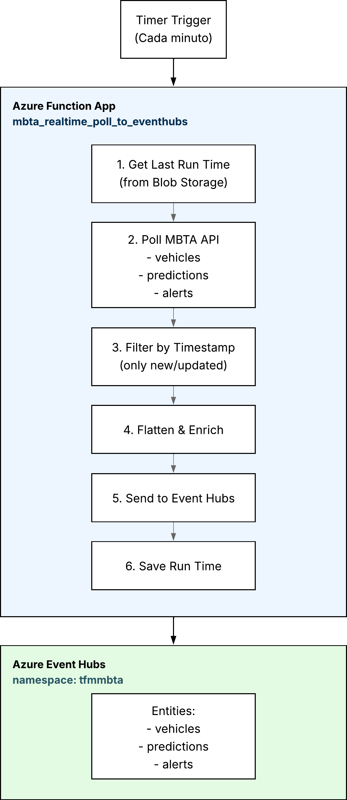
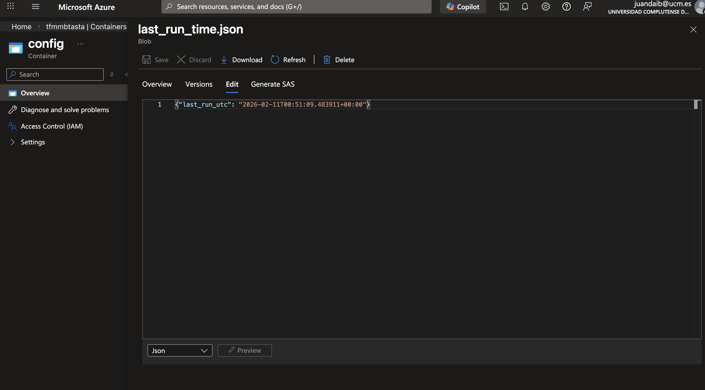
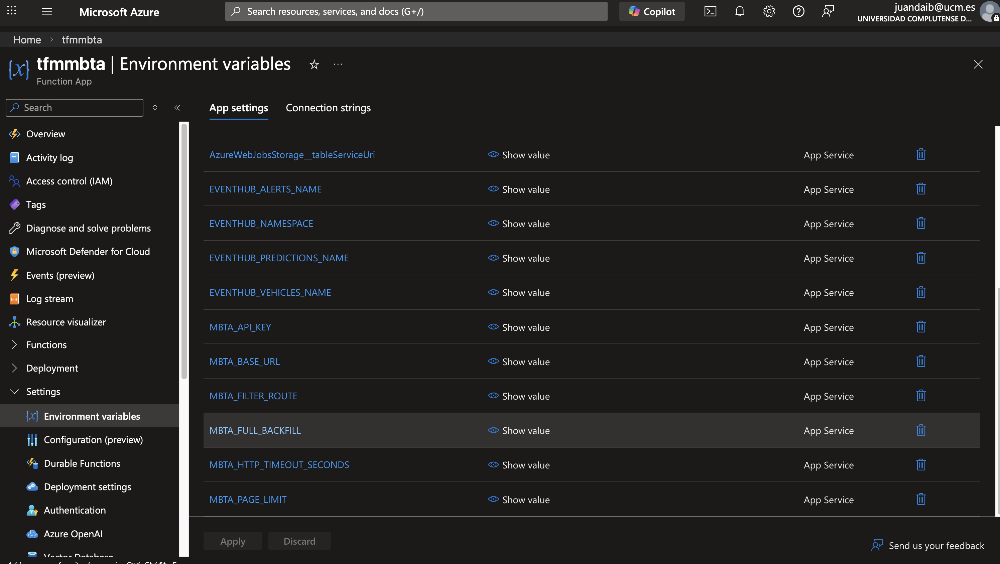
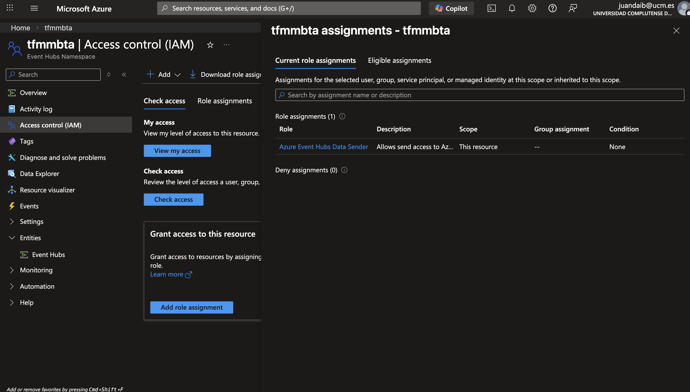
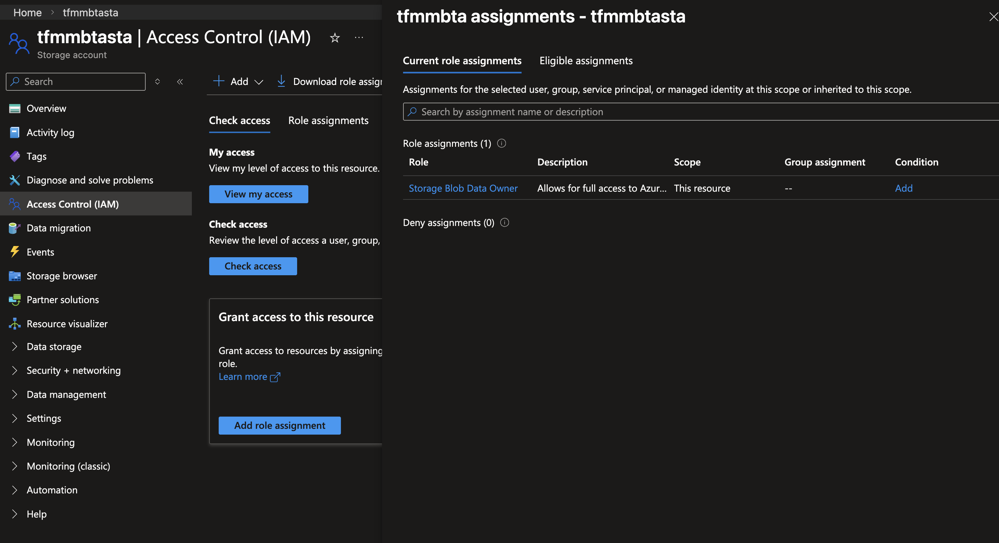

# Realtime Ingestion - Azure Function App


## Tabla de Contenidos

- [Introducción](#introducción)
- [Arquitectura General](#arquitectura-general)
- [Componentes Principales](#componentes-principales)
  - [Azure Function App](#azure-function-app)
  - [Event Hubs Integration](#event-hubs-integration)
  - [Blob Storage State Management](#blob-storage-state-management)
- [Endpoints Consumidos](#endpoints-consumidos)
- [Flujo de Datos](#flujo-de-datos)
- [Configuración](#configuración)
- [Variables de Entorno](#variables-de-entorno)
- [Despliegue](#despliegue)
- [Monitoreo](#monitoreo)

---

## Introducción

Este módulo implementa una **Azure Function App** que consume datos en tiempo real de la API de MBTA (Massachusetts Bay Transportation Authority) y los envía a **Azure Event Hubs** para su procesamiento posterior mediante Stream Analytics.

La función se ejecuta **cada minuto** mediante un trigger timer y extrae datos de tres endpoints principales:
- **Vehicles** (Vehículos en tránsito)
- **Predictions** (Predicciones de llegada)
- **Alerts** (Alertas del sistema)

### Características Principales

- ✅ **Polling incremental**: Solo procesa registros nuevos o actualizados desde la última ejecución
- ✅ **Resiliencia**: Manejo de errores con retry automático y reconexión
- ✅ **Managed Identity**: Autenticación segura sin credenciales hardcodeadas
- ✅ **Paginación automática**: Maneja la API pagination de MBTA de forma transparente
- ✅ **Estado persistente**: Guarda el timestamp de la última ejecución en Blob Storage
- ✅ **Filtrado por rutas**: Configurable para procesar rutas específicas (Red, Orange, Blue, etc.)

---

## Arquitectura General


### Flujo de Alto Nivel



---

## Componentes Principales

### Azure Function App

La función principal se define en [`function_app.py`](function_app.py) y utiliza el decorador de Azure Functions para configurar el trigger:

```python
@app.function_name(name="mbta_realtime_poll_to_eventhubs")
@app.schedule(schedule="0 * * * * *", arg_name="timer", 
              run_on_startup=True, use_monitor=True)
def mbta_realtime_poll_to_eventhubs(timer: func.TimerRequest) -> None:
    """
    Poll real-time MBTA endpoints and write ONE event per record to Event Hubs.
    Schedule: Every minute (0 * * * * *)
    """
```

**Configuración del Timer**:
- **Schedule**: `0 * * * * *` (formato cron - cada minuto)
- **run_on_startup**: `True` - Ejecuta inmediatamente al desplegar
- **use_monitor**: `True` - Habilita métricas en Azure Monitor

### Event Hubs Integration

#### EventHubProducerPool

Clase personalizada que gestiona conexiones persistentes a Event Hubs con auto-reconexión:

```python
class EventHubProducerPool:
    """Manages EventHub producer connections with health checking and auto-reconnect."""
    
    def get_producer(self, eventhub_name: str) -> EventHubProducerClient
    def send_events(self, eventhub_name: str, messages: List[str]) -> int
    def close_all(self)
```

**Características**:
- **Connection pooling**: Reutiliza conexiones entre ejecuciones
- **Auto-reconnect**: Detecta conexiones fallidas y las recrea automáticamente
- **Batch optimization**: Agrupa eventos en batches para mejor throughput
- **Error handling**: Gestiona timeouts y errores AMQP de forma silenciosa

#### Formato de Eventos

Cada evento enviado a Event Hubs tiene la siguiente estructura:

```json
{
  "source": "mbta-v3",
  "endpoint": "/vehicles",
  "record_type": "vehicle",
  "record_id": "y1799",
  "filter_route": "Red",
  "polled_at_utc": "2026-02-15T20:30:00.123456+00:00",
  
  "latitude": 42.365486,
  "longitude": -71.103802,
  "bearing": 180,
  "current_status": "IN_TRANSIT_TO",
  "direction_id": 0,
  "speed": 12.5,
  "trip_id": "61234567",
  "route_id": "Red",
  "stop_id": "70061",
  "updated_at": "2026-02-15T20:29:55+00:00"
}
```

### Blob Storage State Management

#### Persistencia del Estado

La función guarda el timestamp de cada ejecución exitosa en Blob Storage:

```
Container: config
Blob: last_run_time.json
```

Contenido:
```json
{
  "last_run_utc": "2026-02-15T20:30:00.123456+00:00"
}
```

#### Funciones de Estado

```python
def get_last_run_time() -> Optional[datetime]:
    """Retrieve the last successful run timestamp from Blob Storage."""
    
def save_last_run_time(run_time: datetime) -> bool:
    """Save the current run timestamp to Blob Storage."""
```

**Propósito**:
- Habilita **procesamiento incremental**: solo descarga registros nuevos
- Evita duplicados en Event Hubs
- Permite recuperación después de fallos



---

## Endpoints Consumidos

### 1. Vehicles (Vehículos)

**Endpoint**: `GET /vehicles`

**Descripción**: Ubicación en tiempo real de todos los vehículos del sistema MBTA.

**Filtros aplicados**: Ninguno (obtiene todos los vehículos)

**Campos extraídos**:
- `latitude`, `longitude`: Coordenadas GPS
- `bearing`: Dirección del vehículo (0-360°)
- `speed`: Velocidad actual
- `current_status`: Estado (`IN_TRANSIT_TO`, `STOPPED_AT`, `INCOMING_AT`)
- `direction_id`: Dirección de viaje (0 o 1)
- `label`: Identificador del vehículo
- `occupancy_status`: Nivel de ocupación
- `revenue_status`: Si está en servicio o no

**Relaciones (Foreign Keys)**:
- `trip_id`: ID del viaje actual
- `route_id`: ID de la ruta
- `stop_id`: ID de la parada más cercana

**Frecuencia de actualización**: ~cada 5-10 segundos (por MBTA)

---

### 2. Predictions (Predicciones)

**Endpoint**: `GET /predictions`

**Descripción**: Predicciones de llegada/salida para paradas específicas.

**Filtros aplicados**: Por ruta (configurable via `MBTA_FILTER_ROUTE`)

Ejemplo:
```
GET /predictions?filter[route]=Red
```

**Campos extraídos**:
- `arrival_time`: Timestamp predicho de llegada
- `departure_time`: Timestamp predicho de salida
- `stop_sequence`: Número de parada en la secuencia del viaje
- `direction_id`: Dirección (0 o 1)
- `status`: Estado de la predicción
- `schedule_relationship`: Relación con el horario planificado

**Relaciones (Foreign Keys)**:
- `trip_id`: Viaje asociado
- `stop_id`: Parada de la predicción
- `route_id`: Ruta
- `vehicle_id`: Vehículo asociado
- `schedule_id`: Horario planificado

**Frecuencia de actualización**: Cada minuto (en nuestra implementación)

---

### 3. Alerts (Alertas)

**Endpoint**: `GET /alerts`

**Descripción**: Alertas del sistema (retrasos, cierres, eventos especiales).

**Filtros aplicados**: Ninguno (obtiene todas las alertas activas)

**Campos extraídos**:
- `effect`: Efecto de la alerta (`DETOUR`, `DELAY`, `SUSPENSION`, etc.)
- `severity`: Severidad (1-10)
- `header`: Título de la alerta
- `description`: Descripción detallada
- `active_period`: Períodos en que la alerta está activa
- `cause`: Causa (`ACCIDENT`, `WEATHER`, `CONSTRUCTION`, etc.)
- `lifecycle`: Estado del ciclo de vida

**Campos especiales**:
- `informed_entity`: Lista de entidades afectadas (rutas, paradas, viajes)

La función extrae IDs de las entidades afectadas:
```python
{
  "route_ids": ["Red", "Orange"],
  "stop_ids": ["70061", "70063"],
  "trip_ids": ["61234567"]
}
```

---

## Flujo de Datos

### 1. Inicialización

Al iniciar cada ejecución, la función:

1. **Carga configuración** desde variables de entorno
2. **Recupera último timestamp** de ejecución desde Blob Storage
3. **Determina modo de operación**:
   - **Incremental**: Si hay timestamp previo
   - **Full Backfill**: Si es primera ejecución o `MBTA_FULL_BACKFILL=true`

### 2. Polling de MBTA API

Para cada endpoint (vehicles, predictions, alerts):

#### a) Paginación Automática

```python
def fetch_mbta_records(session, endpoint, route_filter, page_limit, timeout_s):
    """
    Fetch all records using JSON:API pagination.
    Follows links.next until exhausted.
    """
```

La función:
1. Hace primera request con `page[limit]` y `page[offset]=0`
2. Extrae `links.next` de la respuesta
3. Sigue el link hasta que `links.next` es `null`
4. Retorna todos los registros acumulados

**Ejemplo de paginación**:
```
Request 1: /vehicles?page[limit]=100&page[offset]=0
Response: { "data": [...], "links": { "next": "/vehicles?page[limit]=100&page[offset]=100" } }

Request 2: /vehicles?page[limit]=100&page[offset]=100
Response: { "data": [...], "links": { "next": "/vehicles?page[limit]=100&page[offset]=200" } }

Request N: /vehicles?page[limit]=100&page[offset]=500
Response: { "data": [...], "links": { "next": null } }
```

#### b) Retry con Backoff Exponencial

```python
def request_get_with_retry(session, url, params, timeout_s):
    """
    Retry for transient errors (429 / 5xx).
    Max 4 retries with exponential backoff.
    """
```

**Manejo de errores**:
- `429 Too Many Requests`: Espera según header `Retry-After`
- `500, 502, 503, 504`: Backoff exponencial (0.7s × 2^attempt)
- `4xx` (excepto 429): Error inmediato
- Timeout: 20 segundos por request

### 3. Filtrado Temporal

```python
def should_include_record(record, cutoff_time):
    """
    Filter records based on updated_at or created_at timestamp.
    """
```

**Lógica**:
1. Si `cutoff_time` es `None` → incluye todo (full backfill)
2. Extrae `updated_at` o `created_at` del registro
3. Compara con `cutoff_time`
4. Solo incluye si `record_time > cutoff_time`

**Ventajas**:
- Evita reprocesar datos antiguos
- Reduce carga en Event Hubs
- Mejora eficiencia del pipeline

### 4. Flattening y Enriquecimiento

```python
def flatten_record(record, endpoint):
    """
    Extract relevant fields and relationship IDs.
    """
```

**Transformaciones**:
1. Extrae atributos relevantes según endpoint
2. Convierte relaciones anidadas a IDs planos
3. Agrega metadata de tracking:
   - `source`: "mbta-v3"
   - `endpoint`: Endpoint de origen
   - `polled_at_utc`: Timestamp de polling
   - `filter_route`: Filtro aplicado

**Antes** (JSON:API format):
```json
{
  "type": "vehicle",
  "id": "y1799",
  "attributes": {
    "latitude": 42.365486,
    "longitude": -71.103802,
    "bearing": 180,
    "speed": 12.5
  },
  "relationships": {
    "trip": { "data": { "id": "61234567", "type": "trip" } },
    "route": { "data": { "id": "Red", "type": "route" } }
  }
}
```

**Después** (Flattened):
```json
{
  "source": "mbta-v3",
  "endpoint": "/vehicles",
  "record_id": "y1799",
  "latitude": 42.365486,
  "longitude": -71.103802,
  "bearing": 180,
  "speed": 12.5,
  "trip_id": "61234567",
  "route_id": "Red",
  "polled_at_utc": "2026-02-15T20:30:00+00:00"
}
```

### 5. Envío a Event Hubs

```python
_producer_pool.send_events(hub_name, messages)
```

**Proceso**:
1. Obtiene producer para el Event Hub destino
2. Crea batch de eventos
3. Agrega eventos uno por uno al batch
4. Si batch se llena → envía y crea nuevo batch
5. Envía batch final con eventos restantes

**Optimizaciones**:
- **Batching**: Agrupa múltiples eventos por eficiencia
- **Connection reuse**: Mantiene conexión abierta entre ejecuciones
- **Auto-reconnect**: Recrea conexión si detecta fallo

### 6. Guardado de Estado

```python
save_last_run_time(current_run_time)
```

Guarda el timestamp de inicio de esta ejecución para usar como filtro en la próxima.

---

## Configuración

### host.json

Define la configuración global de la Function App:

```json
{
  "version": "2.0",
  "logging": {
    "applicationInsights": {
      "samplingSettings": {
        "isEnabled": false,
        "excludedTypes": "Request"
      }
    }
  },
  "extensionBundle": {
    "id": "Microsoft.Azure.Functions.ExtensionBundle",
    "version": "[4.*, 5.0.0)"
  }
}
```

**Notas**:
- `samplingSettings.isEnabled: false`: Captura todos los logs (no sampling)
- `extensionBundle`: Versión 4.x del runtime de Functions

### requirements.txt

Dependencias de Python:

```txt
azure-functions          # Framework de Azure Functions
azure-eventhub          # Cliente de Event Hubs
azure-identity          # Managed Identity authentication
azure-storage-blob      # Para state management
requests                # HTTP client para MBTA API
```

---

## Variables de Entorno

### Obligatorias

| Variable | Descripción | Ejemplo |
|----------|-------------|---------|
| `EVENTHUB_NAMESPACE` | Namespace de Event Hubs (FQDN) | `myeventhub.servicebus.windows.net` |
| `AzureWebJobsStorage` | Connection string de Storage Account | `DefaultEndpointsProtocol=https;...` |

### Opcionales - MBTA API

| Variable | Default | Descripción |
|----------|---------|-------------|
| `MBTA_API_KEY` | (none) | API Key de MBTA (recomendado para rate limits más altos) |
| `MBTA_BASE_URL` | `https://api-v3.mbta.com` | Base URL de la API |
| `MBTA_FILTER_ROUTE` | `["Red"]` | JSON array de rutas a procesar (ej: `["Red", "Orange", "Blue"]`) |
| `MBTA_PAGE_LIMIT` | `100` | Registros por página en API |
| `MBTA_HTTP_TIMEOUT_SECONDS` | `20` | Timeout por HTTP request |
| `MBTA_FULL_BACKFILL` | `false` | Si es `true`, procesa todos los registros (ignora timestamp filtering) |

### Opcionales - Event Hubs

| Variable | Default | Descripción |
|----------|---------|-------------|
| `EVENTHUB_VEHICLES_NAME` | `vehicles` | Nombre del Event Hub para vehículos |
| `EVENTHUB_PREDICTIONS_NAME` | `predictions` | Nombre del Event Hub para predicciones |
| `EVENTHUB_ALERTS_NAME` | `alerts` | Nombre del Event Hub para alertas |




---

## Despliegue

### Prerrequisitos

1. **Azure Resources**:
   - Resource Group
   - Storage Account (para Function App y state)
   - Event Hub Namespace con 3 Event Hubs: `vehicles`, `predictions`, `alerts`
   - Function App (Python 3.11, Consumption Plan o Premium)

2. **Managed Identity**:
   - System Assigned Managed Identity habilitada en Function App
   - Permisos asignados:
     - **Event Hub Data Sender** en cada Event Hub
     - **Storage Blob Data Contributor** en Storage Account




### Pasos de Despliegue

#### 1. Desde Azure Portal

```bash
# Comprimir código
zip -r function.zip . -x "*.git*" -x "*__pycache__*"

# Desplegar via Azure CLI
az functionapp deployment source config-zip \
  -g <resource-group> \
  -n <function-app-name> \
  --src function.zip
```

#### 2. Desde VS Code

1. Instalar extensión **Azure Functions**
2. Click derecho en carpeta del proyecto → **Deploy to Function App**
3. Seleccionar suscripción y Function App
4. Confirmar despliegue

#### 3. Desde GitHub Actions

Ver workflow de CI/CD en repositorio para deployment automatizado.

### Verificación Post-Despliegue

1. **Verificar logs** en Azure Portal:
   ```
   Function App → Functions → mbta_realtime_poll_to_eventhubs → Monitor
   ```

2. **Verificar Event Hubs** tienen eventos:
   ```bash
   # Azure CLI
   az eventhubs eventhub show \
     --resource-group <rg> \
     --namespace-name <namespace> \
     --name vehicles
   ```

3. **Verificar blob de estado** se creó:
   ```
   Storage Account → Containers → config → last_run_time.json
   ```

---

## Monitoreo

### Application Insights

La Function App está integrada con Application Insights para monitoreo completo:

**Métricas disponibles**:
- Execution count
- Success rate
- Average duration
- Failures

**Queries útiles**:

```kusto
// Ejecuciones exitosas en últimas 24h
requests
| where timestamp > ago(24h)
| where name == "mbta_realtime_poll_to_eventhubs"
| where success == true
| summarize count() by bin(timestamp, 1h)
```

```kusto
// Errores agrupados por mensaje
exceptions
| where timestamp > ago(24h)
| where operation_Name == "mbta_realtime_poll_to_eventhubs"
| summarize count() by outerMessage
```

### Custom Logging

La función genera logs detallados en cada paso:

```python
logging.info("MBTA poll start=%s, routes=%s, backfill=%s", ...)
logging.info("Fetched %d records from %s in %d page(s)", ...)
logging.info("Sent %d/%d events to Event Hub '%s'", ...)
logging.warning("Transient HTTP %s for %s. Retry in %.1fs", ...)
logging.error("Failed to send %d events to EventHub '%s': %s", ...)
```

**Niveles de log**:
- `INFO`: Operaciones normales, conteo de eventos
- `WARNING`: Reintentos, problemas transitorios
- `ERROR`: Fallos que requieren atención
- `DEBUG`: Detalles de filtrado de registros

### Alertas Recomendadas

1. **Function Failures**: Si más de 5 ejecuciones fallan en 15 minutos
2. **No Events Sent**: Si `total_sent=0` por más de 5 minutos
3. **High Latency**: Si duración promedio > 30 segundos
4. **Event Hub Connection Failures**: Si aparecen errores de EventHub en logs

---

## Troubleshooting

### Problema: No se envían eventos

**Causas posibles**:
1. Filtro temporal muy restrictivo → verificar `last_run_time.json`
2. API de MBTA no devuelve datos → verificar endpoint manualmente
3. Credenciales incorrectas → verificar Managed Identity

**Solución**:
```bash
# Forzar full backfill
az functionapp config appsettings set \
  -g <rg> -n <function-app> \
  --settings MBTA_FULL_BACKFILL=true
```

### Problema: Timeout en conexión a Event Hubs

**Solución**:
- Verificar que Managed Identity tiene permisos
- Revisar firewall rules en Event Hub Namespace
- Verificar `EVENTHUB_NAMESPACE` está correcto (debe incluir `.servicebus.windows.net`)

### Problema: Errores 429 de MBTA API

**Solución**:
- Configurar `MBTA_API_KEY` para rate limits más altos
- Reducir `MBTA_PAGE_LIMIT` para hacer requests más pequeñas
- La función ya maneja 429 con retry automático

---

## Mejoras Futuras

- [ ] Soporte para múltiples rutas en predictions sin loops
- [ ] Métricas custom en Application Insights (eventos/minuto por endpoint)
- [ ] Dead letter queue para eventos fallidos
- [ ] Compresión de eventos antes de enviar a Event Hubs
- [ ] Health check endpoint HTTP para monitoring externo
- [ ] Procesamiento paralelo de endpoints con asyncio

---

## Referencias

- [Documentación MBTA V3 API](https://api-v3.mbta.com/docs/swagger/index.html)
- [Azure Functions Python Developer Guide](https://docs.microsoft.com/en-us/azure/azure-functions/functions-reference-python)
- [Azure Event Hubs Python SDK](https://docs.microsoft.com/en-us/python/api/overview/azure/eventhub-readme)
- [Managed Identity in Azure Functions](https://docs.microsoft.com/en-us/azure/app-service/overview-managed-identity)
