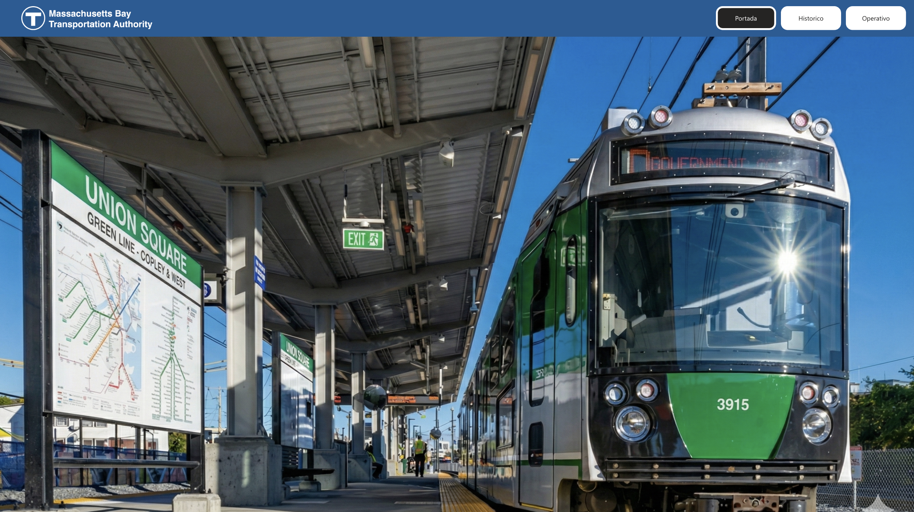
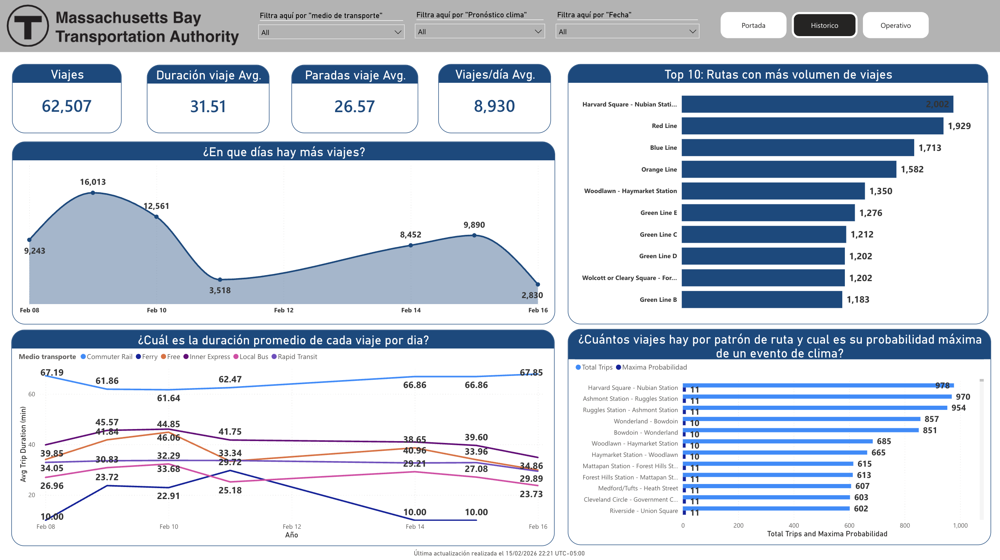
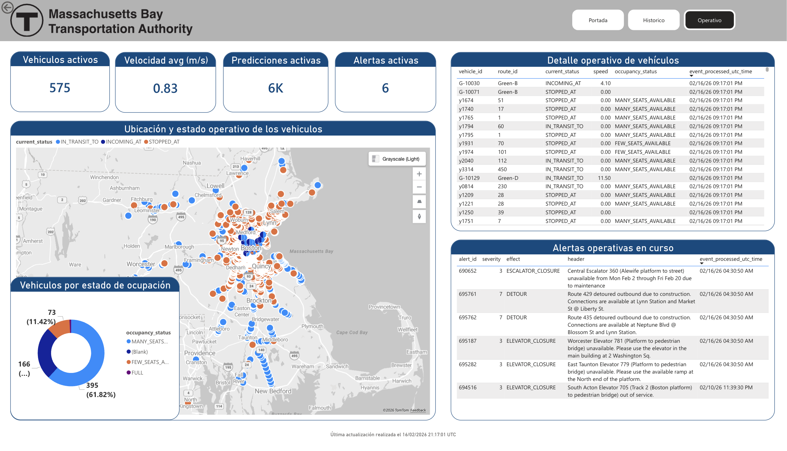

# Reporting Power BI - Dashboard MBTA


## Tabla de Contenidos

- [Introducción](#introducción)
- [¿Qué es Power BI?](#qué-es-power-bi)
- [Fuentes de Datos](#fuentes-de-datos)
- [Páginas del Dashboard](#páginas-del-dashboard)
  - [Portada](#portada)
  - [Histórico](#histórico)
  - [Operativo](#operativo)
- [Componentes y Visualizaciones](#componentes-y-visualizaciones)
- [Medidas DAX](#medidas-dax)
- [Interactividad y Filtros](#interactividad-y-filtros)
- [Actualización de Datos](#actualización-de-datos)

---

## Introducción

Este módulo contiene el **Dashboard interactivo de Power BI** que visualiza datos del sistema MBTA (Massachusetts Bay Transportation Authority) en tiempo real y histórico.

El dashboard proporciona insights sobre:
- 📊 **Análisis histórico**: Patrones de viajes, duración promedio, volumen por rutas
- 🚇 **Monitoreo operativo**: Vehículos activos, alertas, predicciones en tiempo real
- 🗺️ **Visualización geográfica**: Mapa de vehículos con estado y ocupación
- 📈 **KPIs**: Métricas clave de rendimiento del sistema de transporte

### Características Principales

- ✅ **Actualización en tiempo real**: Datos streaming desde Azure Stream Analytics
- ✅ **Análisis histórico**: Datos batch procesados por Kedro desde Data Lake
- ✅ **Interactividad**: Filtros cross-page y drill-down
- ✅ **Responsive Design**: Optimizado para desktop y móvil
- ✅ **Temas personalizados**: Colores MBTA (verde, azul, naranja, rojo)
- ✅ **Embeddable**: Puede integrarse en aplicaciones web

---

## ¿Qué es Power BI?

**Power BI** es una plataforma de análisis de negocio de Microsoft que permite conectar, transformar, visualizar y compartir datos mediante dashboards interactivos.

### Componentes Clave

#### Power BI Desktop
Aplicación Windows/Mac para diseñar informes:
- Editor de visualizaciones (charts, maps, tables)
- Power Query para transformación de datos
- DAX (Data Analysis Expressions) para medidas calculadas
- Modelado de datos con relaciones

#### Power BI Service
Plataforma cloud para publicar y compartir:
- Workspaces colaborativos
- Scheduled refresh de datasets
- Distribución de informes (web, mobile, embeds)
- Row-Level Security (RLS)

### Conceptos Clave

**Dataset (Semantic Model)**:
- Modelo de datos con tablas y relaciones
- Medidas DAX
- Conexiones a fuentes de datos

**Report**:
- Colección de páginas con visualizaciones
- Usa un dataset como fuente
- Interactividad y navegación

**Dashboard**:
- Tiles (mosaicos) de múltiples informes
- Vista ejecutiva de alto nivel
- Actualización automática

---

## Fuentes de Datos

### 1. Databricks Unity Catalog (Batch)

**Propósito**: Datos históricos procesados por el pipeline Kedro en el data lakehouse.

**Esquemas del Data Lakehouse**:
- **Bronze**: Datos raw sin transformaciones significativas
- **Silver**: Datos limpios y normalizados
- **Gold**: Tablas agregadas y métricas analíticas

**Tablas consolidadas (Gold)**:
- `gold.trips_metrics`: Métricas de viajes (duración, paradas, rutas)
- `gold.routes_forecast`: Rutas enriquecidas con pronósticos meteorológicos

**Modo de conexión**: Import (scheduled refresh)

**Cluster Databricks**: Compute cluster con Unity Catalog habilitado

---

### 2. Power BI Streaming Datasets (Real-time)

**Propósito**: Datos en vivo desde Azure Stream Analytics.

**Datasets**:
- `tfmasajob_vehicles` → tabla `stream_vehicles`
- `tfmasajob_predictions` → tabla `stream_predictions`
- `tfmasajob_alerts` → tabla `stream_alerts`

**Modo de conexión**: DirectQuery (sin refresh, siempre actualizado)

**Características**:
- Latencia < 5 segundos desde el evento
- No almacena histórico (solo últimos datos)
- Ideal para tiles de tiempo real

---

## Páginas del Dashboard

### Portada



**Propósito**: Landing page con branding y navegación.

**Elementos**:
- Logo de MBTA
- Título del dashboard
- Botones de navegación a páginas:
  - **Portada** (Home)
  - **Histórico** (Análisis de datos batch)
  - **Operativo** (Monitoreo en tiempo real)
- Imagen de tren en estación Union Square

**Interactividad**: Navegación mediante botones personalizados.

---

### Histórico



**Propósito**: Análisis de patrones históricos del sistema MBTA.

#### KPIs Principales

| Métrica | Descripción | Fuente |
|---------|-------------|--------|
| **Viajes** | Total de viajes en el período | `trips_metrics` |
| **Duración viaje Avg.** | Duración promedio en minutos | Calculado con DAX |
| **Paradas viaje Avg.** | Promedio de paradas por viaje | `trips_metrics` |
| **Viajes/día Avg.** | Promedio diario de viajes | Agregación temporal |

#### Visualizaciones

**1. ¿En qué días hay más viajes?**
- **Tipo**: Gráfico de área
- **Datos**: Conteo de viajes por fecha
- **Insight**: Identifica picos (ej: Lunes y Viernes > fines de semana)

**2. ¿Cuál es la duración promedio de cada viaje por día?**
- **Tipo**: Gráfico de líneas múltiples
- **Series**:
  - Por medio de transporte (Commuter Rail, Ferry, Bus, etc.)
- **Insight**: Variabilidad de duración según modo y día

**3. Top 10: Rutas con más volumen de viajes**
- **Tipo**: Gráfico de barras horizontales
- **Datos**: Suma de viajes por ruta
- **Insight**: Red Line, Blue Line, Orange Line son las más usadas

**4. ¿Cuántos viajes hay por patrón de ruta y cuál es su probabilidad máxima de un evento de clima?**
- **Tipo**: Gráfico de barras con dual axis
- **Eje primario**: Total de viajes por patrón de ruta
- **Eje secundario**: Máxima probabilidad de evento climático
- **Insight**: Correlación entre rutas específicas y eventos climáticos

#### Filtros Interactivos

- **Medio de transporte**: Commuter Rail, Ferry, Bus, Rapid Transit, etc.
- **Pronóstico clima**: Filtro por tipo de pronóstico
- **Fecha**: Date slicer para rango temporal

---

### Operativo



**Propósito**: Monitoreo en tiempo real del sistema MBTA.

#### KPIs Principales (Streaming)

| Métrica | Descripción | Fuente |
|---------|-------------|--------|
| **Vehículos activos** | Vehículos actualmente en servicio | `stream_vehicles` |
| **Velocidad avg (m/s)** | Velocidad promedio de la flota | `stream_vehicles.speed` |
| **Predicciones activas** | Total de predicciones vigentes | `stream_predictions` |
| **Alertas activas** | Alertas actuales en el sistema | `stream_alerts` |

#### Visualizaciones en Tiempo Real

**1. Ubicación y estado operativo de los vehículos**
- **Tipo**: Mapa interactivo (Azure Maps o Bing Maps)
- **Markers**: 
  - 🔵 Azul: `IN_TRANSIT_TO` (en tránsito)
  - 🟠 Naranja: `INCOMING_AT` (llegando)
  - 🔴 Rojo: `STOPPED_AT` (detenido)
- **Tooltips**: vehicle_id, route_id, current_status, speed, occupancy_status
- **Clusters**: Agrupa vehículos cercanos para mejor rendimiento

**2. Vehículos por estado de ocupación**
- **Tipo**: Gráfico de dona
- **Categorías**:
  - `MANY_SEATS_AVAILABLE`
  - `FEW_SEATS_AVAILABLE`
  - `FULL`
  - (Blank)
- **Insight**: Nivel de ocupación de la flota en tiempo real

**3. Detalle operativo de vehículos**
- **Tipo**: Tabla detallada
- **Columnas**:
  - `vehicle_id`
  - `route_id`
  - `current_status`
  - `speed`
  - `occupancy_status`
  - `event_processed_utc_time` (timestamp)
- **Características**: 
  - Scrollable
  - Actualización automática cada 5 segundos

**4. Alertas operativas en curso**
- **Tipo**: Tabla con formato condicional
- **Columnas**:
  - `alert_id`
  - `severity` (color coding: 1-3=🟢, 4-7=🟡, 8-10=🔴)
  - `effect` (DETOUR, DELAY, SUSPENSION, etc.)
  - `header`
  - `event_processed_utc_time`
- **Filtro**: Solo alertas con `is_active_alert = 1`

#### Auto-Refresh

La página Operativo está configurada para auto-refresh cada **5 segundos** cuando está publicada en Power BI Service.

---

## Componentes y Visualizaciones

### Tipos de Visuales Utilizados

| Visual | Uso | Página |
|--------|-----|--------|
| **Card** | KPIs numéricos | Histórico, Operativo |
| **Area Chart** | Tendencias temporales | Histórico |
| **Line Chart** | Comparación series temporales | Histórico |
| **Bar Chart** | Ranking de rutas | Histórico |
| **Dual Axis Chart** | Correlación de métricas | Histórico |
| **Map** | Geolocalización de vehículos | Operativo |
| **Donut Chart** | Distribución proporcional | Operativo |
| **Table** | Detalle granular | Operativo |
| **Button** | Navegación | Todas |
| **Image** | Branding | Portada |

### Temas y Colores

**Paleta MBTA**:
- 🔴 Red Line: `#DA291C`
- 🟠 Orange Line: `#ED8B00`
- 🔵 Blue Line: `#003DA5`
- 🟢 Green Line: `#00843D`
- ⚪ Silver Line: `#7C878E`

**Aplicación**:
- Ejes y títulos: Azul MBTA (`#003DA5`)
- Fondos: Blanco/Gris claro
- Destacados: Según línea de ruta

---

## Medidas DAX

### Ejemplos de Medidas Calculadas

#### 1. Total de Viajes

```dax
Total Viajes = COUNTROWS(fact_vehicles)
```

#### 2. Duración Promedio de Viaje

```dax
Duración Viaje Avg = 
AVERAGE(
    DATEDIFF(
        fact_vehicles[trip_start_time],
        fact_vehicles[trip_end_time],
        MINUTE
    )
)
```

#### 3. Velocidad Promedio Flota (Real-time)

```dax
Velocidad Avg (m/s) = 
AVERAGE(stream_vehicles[speed])
```

#### 4. Vehículos Activos Ahora

```dax
Vehículos Activos = 
CALCULATE(
    COUNTROWS(stream_vehicles),
    stream_vehicles[current_status] <> "STOPPED_AT"
)
```

#### 5. Alertas Activas con Alta Severidad

```dax
Alertas Alta Severidad = 
CALCULATE(
    COUNTROWS(stream_alerts),
    stream_alerts[is_active_alert] = 1,
    stream_alerts[severity] >= 7
)
```

#### 6. Tasa de Cumplimiento de Predicciones

```dax
Tasa Cumplimiento Predicciones = 
DIVIDE(
    CALCULATE(
        COUNTROWS(fact_predictions),
        ABS(fact_predictions[predicted_arrival_utc_time] - fact_predictions[actual_arrival_utc_time]) <= 5
    ),
    COUNTROWS(fact_predictions),
    0
)
```
*Nota: Cuenta predicciones con error ≤ 5 minutos*

---

## Interactividad y Filtros

### Cross-Page Filtering

Los filtros aplicados en una página persisten al navegar a otras páginas (configurable).

**Ejemplo**:
1. Usuario filtra por `Red Line` en página Histórico
2. Al navegar a Operativo, solo ve vehículos de Red Line

### Drill-Through

Click derecho en una ruta → "Drill through to details" → Ver detalles granulares de esa ruta específica.

### Slicers (Filtros)

**Histórico**:
- Date range picker
- Multi-select: Medio de transporte
- Single-select: Pronóstico clima

**Operativo**:
- Multi-select: Rutas
- Toggle: Solo alertas activas

### Tooltips Personalizados

Al pasar el mouse sobre un marker del mapa:
```
Vehicle: y1799
Route: Red Line
Status: IN_TRANSIT_TO
Speed: 12.5 m/s
Occupancy: MANY_SEATS_AVAILABLE
Last Update: 2026-02-16 09:17:01 PM
```

---

## Actualización de Datos

### Scheduled Refresh (Datos Históricos)

**Dataset**: `DASHBOARD_MBTA` (Import mode)

**Configuración**:
- **Frecuencia**: Cada 1 hora
- **Horario**: 24/7
- **Time zone**: UTC
- **Gateway**: On-premises Data Gateway (si Databricks está en VNET privada)

**Proceso**:
1. Power BI Service conecta a Databricks SQL Warehouse
2. Ejecuta queries sobre Unity Catalog (schemas silver/gold)
3. Refresca modelo en memoria
4. Notifica a tiles y reportes

> **[CAPTURA RECOMENDADA]**: Power BI Service mostrando:
> - Dataset settings con scheduled refresh
> - Refresh history con últimas ejecuciones exitosas

---

### Real-time Updates (Datos Streaming)

**Datasets**: `tfmasajob_vehicles`, `tfmasajob_predictions`, `tfmasajob_alerts`

**Configuración**:
- **Modo**: DirectQuery (sin refresh)
- **Latencia**: < 5 segundos desde Stream Analytics
- **Auto-refresh**: Página actualiza cada 5 segundos (configurable en Page settings)

**Límites**:
- Max 15,000 rows por dataset streaming
- Older data se descarta automáticamente
- No histórico persistente

---

## Mejoras Futuras

- [ ] Agregar página de análisis de retrasos (delay analysis)
- [ ] Implementar predicción de demanda con ML models
- [ ] Crear alertas proactivas vía Power Automate
- [ ] Agregar drill-through a nivel de vehículo individual
- [ ] Implementar bookmarks para vistas predefinidas
- [ ] Mobile layout optimizado
- [ ] Accessibility (alt text, screen reader support)
- [ ] Exportar datos a Excel con un click
- [ ] Integración con Microsoft Teams (notificaciones de alertas)
- [ ] Historical playback (reproducir estado del sistema en el pasado)

---

## Referencias

- [Documentación Power BI](https://docs.microsoft.com/en-us/power-bi/)
- [DAX Guide](https://dax.guide/)
- [Power BI Streaming Datasets](https://docs.microsoft.com/en-us/power-bi/connect-data/service-real-time-streaming)
- [Power BI Embed](https://docs.microsoft.com/en-us/power-bi/developer/embedded/embedding)
- [Best Practices for Power BI](https://docs.microsoft.com/en-us/power-bi/guidance/power-bi-optimization)
- [MBTA Brand Guidelines](https://www.mbta.com/policies/brand-guidelines)
