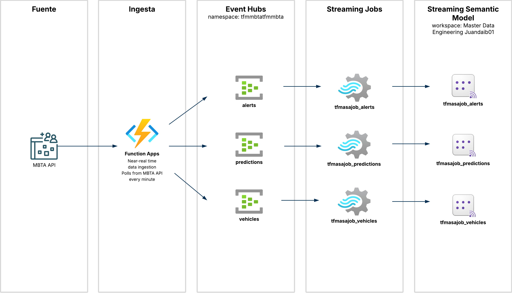
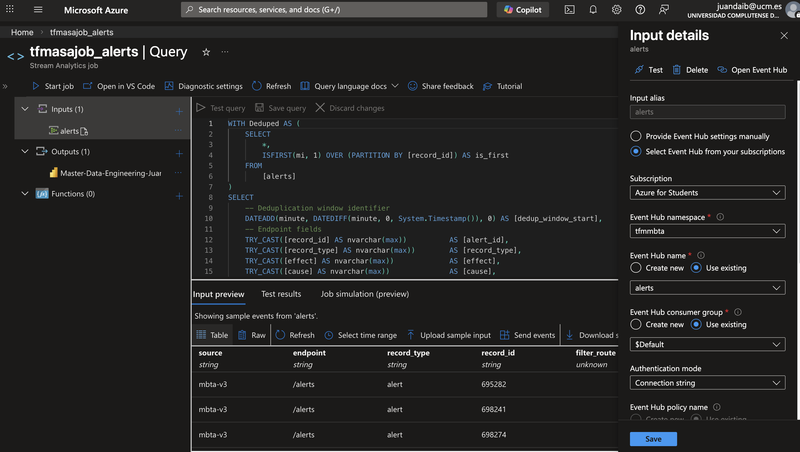
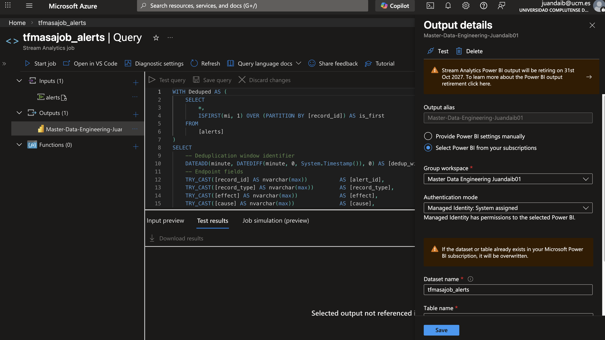
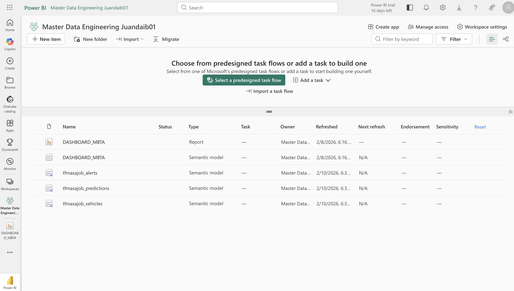
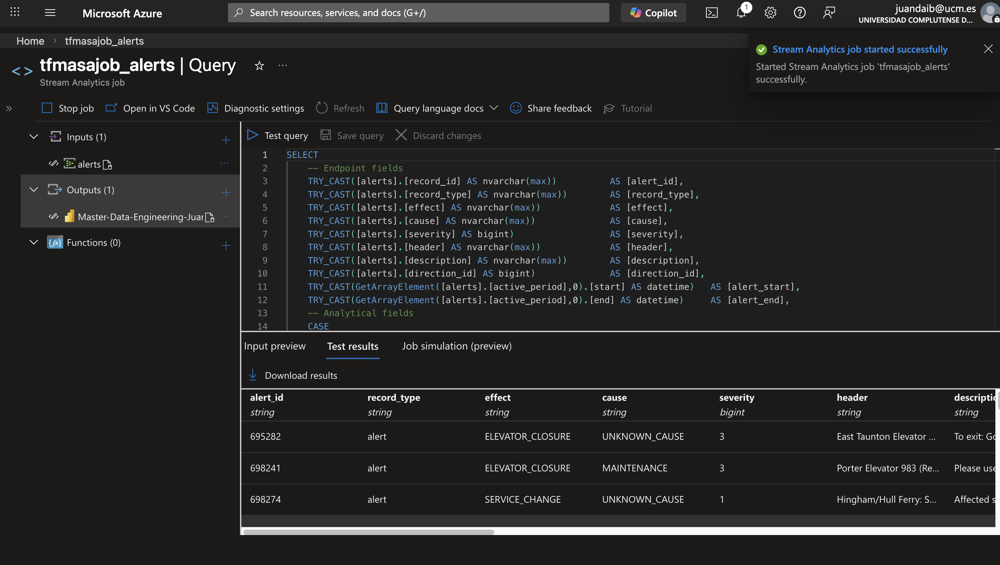

# Streaming Processing - Azure Stream Analytics


## Tabla de Contenidos

- [Introducción](#introducción)
- [¿Qué es Azure Stream Analytics?](#qué-es-azure-stream-analytics)
- [Arquitectura General](#arquitectura-general)
- [Stream Analytics Jobs](#stream-analytics-jobs)
  - [tfmasajob_vehicles](#tfmasajob_vehicles)
  - [tfmasajob_predictions](#tfmasajob_predictions)
  - [tfmasajob_alerts](#tfmasajob_alerts)
- [Inputs y Outputs](#inputs-y-outputs)
- [Transformaciones SQL](#transformaciones-sql)
- [Configuración de Jobs](#configuración-de-jobs)
- [Despliegue](#despliegue)
- [Monitoreo](#monitoreo)

---

## Introducción

Este módulo contiene los **Azure Stream Analytics Jobs** que procesan en tiempo real los eventos de MBTA provenientes de Event Hubs y los envían a Power BI para visualización en dashboards.

Existen **3 jobs independientes**, uno por cada tipo de dato:
- **tfmasajob_vehicles**: Procesa ubicaciones de vehículos
- **tfmasajob_predictions**: Procesa predicciones de llegada
- **tfmasajob_alerts**: Procesa alertas del sistema

### Características Principales

- ✅ **Procesamiento en tiempo real**: Latencia < 5 segundos desde Event Hub hasta Power BI
- ✅ **Transformación con SQL**: Query language familiar para analistas
- ✅ **Tipado fuerte**: Conversión explícita de tipos con `TRY_CAST`
- ✅ **Campos calculados**: Lógica analítica directamente en el stream
- ✅ **Managed Identity**: Autenticación segura sin credenciales
- ✅ **Auto-scaling**: Se ajusta automáticamente a la carga

---

## ¿Qué es Azure Stream Analytics?

**Azure Stream Analytics (ASA)** es un motor de procesamiento de eventos en tiempo real completamente administrado que permite ejecutar consultas SQL sobre streams de datos.

### Conceptos Clave

#### Inputs
Fuentes de datos de streaming:
- **Event Hubs**: Streams de alta velocidad
- **IoT Hub**: Telemetría de dispositivos
- **Blob Storage**: Datos de referencia

#### Query
Transformación escrita en SQL-like language:
```sql
SELECT field1, field2, DATEDIFF(minute, start, end) AS duration
INTO output
FROM input
WHERE condition = true
```

#### Outputs
Destinos de los datos procesados:
- **Power BI**: Dashboards en tiempo real
- **SQL Database**: Almacenamiento relacional
- **Blob Storage**: Data lake
- **Event Hubs**: Downstream processing

#### Windowing
Funciones temporales para agregaciones:
- **Tumbling Window**: Ventanas fijas sin solapamiento
- **Hopping Window**: Ventanas con solapamiento
- **Session Window**: Agrupación por inactividad
- **Sliding Window**: Ventana móvil continua

> **Nota**: En este proyecto usamos **pass-through queries** sin windowing, procesando cada evento individualmente.

---

## Arquitectura General



---

## Stream Analytics Jobs

### tfmasajob_vehicles

**Propósito**: Procesa eventos de ubicación de vehículos en tiempo real.

**Input**: Event Hub `vehicles`

**Output**: Power BI dataset `tfmasajob_vehicles` → tabla `stream_vehicles`

#### Schema de Salida

| Campo | Tipo | Descripción |
|-------|------|-------------|
| `record_id` | nvarchar(max) | ID del vehículo |
| `record_type` | nvarchar(max) | Tipo de registro ("vehicle") |
| `bearing` | bigint | Dirección en grados (0-360, -1 si NULL) |
| `stop_sequence` | bigint | Secuencia de parada actual |
| `direction_id` | bigint | Dirección de viaje (0 o 1) |
| `speed` | float | Velocidad actual (0.0 si NULL) |
| `latitude` | float | Latitud GPS |
| `longitude` | float | Longitud GPS |
| `occupancy_status` | nvarchar(max) | Nivel de ocupación |
| `current_status` | nvarchar(max) | Estado actual del vehículo |
| `label` | nvarchar(max) | Etiqueta visible del vehículo |
| `created_at` | datetime | Timestamp de creación MBTA |
| `updated_at` | datetime | Timestamp de actualización MBTA |
| `trip_id` | nvarchar(max) | FK → Viaje |
| `stop_id` | nvarchar(max) | FK → Parada |
| `route_id` | nvarchar(max) | FK → Ruta |
| `event_polled_utc_time` | datetime | Cuándo se hizo polling a MBTA API |
| `event_processed_utc_time` | datetime | Cuándo ASA procesó el evento |
| `event_enqueued_utc_time` | datetime | Cuándo llegó a Event Hub |

#### Transformación

```sql
SELECT
    TRY_CAST([vehicles].[record_id] AS nvarchar(max))        AS [record_id],
    TRY_CAST(COALESCE([vehicles].[bearing], -1) AS bigint)   AS [bearing],
    TRY_CAST(COALESCE([vehicles].[speed], 0.0) AS float)     AS [speed],
    TRY_CAST([vehicles].[latitude] AS float)                 AS [latitude],
    TRY_CAST([vehicles].[longitude] AS float)                AS [longitude],
    -- ... más campos ...
INTO [Master-Data-Engineering-Juandaib01]
FROM [vehicles]
```

**Características especiales**:
- `COALESCE([bearing], -1)`: Reemplaza NULL por -1 para bearing
- `COALESCE([speed], 0.0)`: Reemplaza NULL por 0.0 para speed
- Tracking de 3 timestamps: polling, enqueue, processing

---

### tfmasajob_predictions

**Propósito**: Procesa predicciones de llegada/salida de vehículos.

**Input**: Event Hub `predictions`

**Output**: Power BI dataset `tfmasajob_predictions` → tabla `stream_predictions`

#### Schema de Salida

| Campo | Tipo | Descripción |
|-------|------|-------------|
| `prediction_id` | nvarchar(max) | ID de la predicción |
| `record_type` | nvarchar(max) | Tipo de registro ("prediction") |
| `predicted_departure_utc_time` | datetime | Hora predicha de salida |
| `predicted_arrival_utc_time` | datetime | Hora predicha de llegada |
| `direction_id` | bigint | Dirección de viaje (0 o 1) |
| `stop_sequence` | bigint | Secuencia de la parada |
| `status` | nvarchar(max) | Estado de la predicción |
| `schedule_relationship` | nvarchar(max) | Relación con el horario |
| `route_id` | nvarchar(max) | FK → Ruta |
| `trip_id` | nvarchar(max) | FK → Viaje |
| `stop_id` | nvarchar(max) | FK → Parada |
| `created_at` | datetime | Timestamp de creación MBTA |
| `updated_at` | datetime | Timestamp de actualización MBTA |
| `event_polled_utc_time` | datetime | Timestamp de polling |
| `event_processed_utc_time` | datetime | Timestamp de procesamiento ASA |
| `event_enqueued_utc_time` | datetime | Timestamp de llegada a Event Hub |

#### Transformación

```sql
SELECT
    TRY_CAST([predictions].[record_id] AS nvarchar(max))     AS [prediction_id],
    TRY_CAST([predictions].[departure_time] AS datetime)     AS [predicted_departure_utc_time],
    TRY_CAST([predictions].[arrival_time] AS datetime)       AS [predicted_arrival_utc_time],
    TRY_CAST([predictions].[direction_id] AS bigint)         AS [direction_id],
    -- ... más campos ...
INTO [Master-Data-Engineering-Juandaib01]
FROM [predictions]
```

**Uso en dashboards**:
- Comparación de tiempos reales vs predichos
- Cálculo de delays en tiempo real
- Alertas de retrasos significativos

---

### tfmasajob_alerts

**Propósito**: Procesa alertas del sistema MBTA (retrasos, cierres, eventos).

**Input**: Event Hub `alerts`

**Output**: Power BI dataset `tfmasajob_alerts` → tabla `stream_alerts`

#### Schema de Salida

| Campo | Tipo | Descripción |
|-------|------|-------------|
| `alert_id` | nvarchar(max) | ID de la alerta |
| `record_type` | nvarchar(max) | Tipo de registro ("alert") |
| `effect` | nvarchar(max) | Efecto (DETOUR, DELAY, SUSPENSION, etc.) |
| `cause` | nvarchar(max) | Causa (ACCIDENT, WEATHER, CONSTRUCTION, etc.) |
| `severity` | bigint | Severidad (1-10) |
| `header` | nvarchar(max) | Título de la alerta |
| `description` | nvarchar(max) | Descripción detallada |
| `direction_id` | bigint | Dirección afectada |
| `alert_start` | datetime | Inicio del período activo |
| `alert_end` | datetime | Fin del período activo |
| `is_active_alert` | bigint | 1 si está activa, 0 si no (calculado) |
| `alert_duration_minutes` | bigint | Duración en minutos (calculado) |
| `route_ids` | array | Array de rutas afectadas |
| `stop_ids` | array | Array de paradas afectadas |
| `created_at` | datetime | Timestamp de creación MBTA |
| `updated_at` | datetime | Timestamp de actualización MBTA |
| `event_polled_utc_time` | datetime | Timestamp de polling |
| `event_processed_utc_time` | datetime | Timestamp de procesamiento ASA |
| `event_enqueued_utc_time` | datetime | Timestamp de llegada a Event Hub |

#### Transformación con Lógica Analítica

```sql
SELECT
    TRY_CAST([alerts].[record_id] AS nvarchar(max))    AS [alert_id],
    TRY_CAST([alerts].[effect] AS nvarchar(max))       AS [effect],
    TRY_CAST([alerts].[severity] AS bigint)            AS [severity],
    
    -- Extracción del primer período activo
    TRY_CAST(GetArrayElement([alerts].[active_period],0).[start] AS datetime) AS [alert_start],
    TRY_CAST(GetArrayElement([alerts].[active_period],0).[end] AS datetime)   AS [alert_end],
    
    -- Campo calculado: ¿Está activa?
    CASE
        WHEN [alerts].[lifecycle] = 'ONGOING' THEN 1
        ELSE 0
    END AS [is_active_alert],
    
    -- Campo calculado: Duración en minutos
    CASE
        WHEN GetArrayElement([alerts].[active_period],0).[end] IS NOT NULL THEN
            DATEDIFF(minute,
                TRY_CAST(GetArrayElement([alerts].[active_period],0).[start] AS datetime),
                TRY_CAST(GetArrayElement([alerts].[active_period],0).[end] AS datetime)
            )
        ELSE
            DATEDIFF(minute,
                TRY_CAST(GetArrayElement([alerts].[active_period],0).[start] AS datetime),
                TRY_CAST([alerts].[EventProcessedUtcTime] AS datetime)
            )
    END AS [alert_duration_minutes],
    
    -- Arrays de entidades afectadas
    TRY_CAST([alerts].[route_ids] AS array)  AS [route_ids],
    TRY_CAST([alerts].[stop_ids] AS array)   AS [stop_ids]
    
INTO [Master-Data-Engineering-Juandaib01]
FROM [alerts]
```

**Campos calculados**:

1. **`is_active_alert`**: Bandera binaria basada en lifecycle
   ```sql
   CASE WHEN [lifecycle] = 'ONGOING' THEN 1 ELSE 0 END
   ```

2. **`alert_duration_minutes`**: Duración total o parcial
   - Si la alerta tiene `end` → diferencia entre `start` y `end`
   - Si no tiene `end` (alerta abierta) → diferencia entre `start` y tiempo actual de procesamiento

**Uso en dashboards**:
- Mapa de alertas activas por ruta
- KPI de tiempo promedio de resolución
- Distribución de alertas por causa y severidad

---

## Inputs y Outputs

### Configuración de Inputs

Todos los inputs son **Event Hubs** con las siguientes características comunes:

```json
{
  "Type": "Data Stream",
  "DataSourceType": "Microsoft.ServiceBus/EventHub",
  "Properties": {
    "ServiceBusNamespace": "tfmmbta",
    "EventHubName": "<hub_name>",
    "SharedAccessPolicyName": "<policy_name>",
    "ConsumerGroupName": "$Default",
    "Serialization": {
      "Type": "JSON",
      "Properties": {
        "Encoding": "UTF8"
      }
    }
  }
}
```

| Job | Event Hub | Consumer Group |
|-----|-----------|----------------|
| tfmasajob_vehicles | `vehicles` | `$Default` |
| tfmasajob_predictions | `predictions` | `$Default` |
| tfmasajob_alerts | `alerts` | `$Default` |

**Autenticación**: Shared Access Policy (recomendación: migrar a Managed Identity)



---

### Configuración de Outputs

Todos los outputs son **Power BI** usando **Managed Identity**:

```json
{
  "DataSourceType": "Power BI",
  "PowerBIProperties": {
    "GroupName": "Master Data Engineering Juandaib01",
    "GroupId": "5b2a2a3d-2db1-48a4-9d09-a668e4cc9987",
    "Dataset": "<dataset_name>",
    "Table": "<table_name>",
    "AuthenticationMode": "Msi"
  }
}
```

| Job | Dataset | Table |
|-----|---------|-------|
| tfmasajob_vehicles | `tfmasajob_vehicles` | `stream_vehicles` |
| tfmasajob_predictions | `tfmasajob_predictions` | `stream_predictions` |
| tfmasajob_alerts | `tfmasajob_alerts` | `stream_alerts` |

**Power BI Workspace**: `Master Data Engineering Juandaib01`

**Ventajas de Managed Identity**:
- No requiere re-autenticación cada 90 días
- Más seguro que OAuth
- Se integra con RBAC de Azure




---

## Transformaciones SQL

### Patrón Común: TRY_CAST

Todos los queries usan `TRY_CAST` en lugar de `CAST` para evitar fallos en caso de datos malformados:

```sql
-- ❌ Malo: Falla si el campo no es casteable
CAST([field] AS bigint)

-- ✅ Bueno: Retorna NULL si falla, el job continúa
TRY_CAST([field] AS bigint)
```

### Manejo de Valores NULL

#### Opción 1: COALESCE con valor por defecto

```sql
TRY_CAST(COALESCE([bearing], -1) AS bigint) AS [bearing]
TRY_CAST(COALESCE([speed], 0.0) AS float)   AS [speed]
```

**Cuándo usar**: Cuando NULL tiene un significado especial (ej: bearing=-1 significa "sin dirección conocida")

#### Opción 2: Permitir NULL

```sql
TRY_CAST([stop_id] AS nvarchar(max)) AS [stop_id]
```

**Cuándo usar**: Cuando NULL es un valor válido (ej: vehículo sin parada asignada aún)

### Extracción de Arrays

Para campos anidados como `active_period`:

```sql
-- Extraer el primer elemento del array
TRY_CAST(GetArrayElement([alerts].[active_period], 0).[start] AS datetime)

-- 0 = primer elemento (zero-indexed)
```

**Limitación**: Solo accedemos al primer período activo. Si una alerta tiene múltiples períodos, solo vemos el primero.

### Funciones de Fecha

```sql
-- Diferencia entre dos timestamps
DATEDIFF(minute, start_time, end_time)

-- Unidades disponibles: second, minute, hour, day, week, month, year
```

### CASE Statements

```sql
CASE
    WHEN condition1 THEN value1
    WHEN condition2 THEN value2
    ELSE default_value
END AS [computed_field]
```

---

## Configuración de Jobs

### JobConfig.json

Configuración común a los 3 jobs:

```json
{
    "OutputErrorPolicy": "Retry",
    "EventsLateArrivalMaxDelayInSeconds": 5,
    "EventsOutOfOrderMaxDelayInSeconds": 5,
    "EventsOutOfOrderPolicy": "Adjust",
    "Sku": {
        "Name": "StandardV2",
        "StreamingUnits": "1"
    },
    "CompatibilityLevel": "1.2",
    "UseSystemAssignedIdentity": true
}
```

### Parámetros Clave

| Parámetro | Valor | Descripción |
|-----------|-------|-------------|
| `OutputErrorPolicy` | `Retry` | Reintenta enviar eventos fallidos al output |
| `EventsLateArrivalMaxDelayInSeconds` | `5` | Acepta eventos con hasta 5 segundos de retraso |
| `EventsOutOfOrderMaxDelayInSeconds` | `5` | Tolera hasta 5 segundos de desorden temporal |
| `EventsOutOfOrderPolicy` | `Adjust` | Ajusta timestamps de eventos desordenados |
| `Sku.Name` | `StandardV2` | Tipo de SKU (v2 = mejor rendimiento) |
| `StreamingUnits` | `1` | Capacidad de procesamiento (1 SU = hasta 1 MB/s) |
| `CompatibilityLevel` | `1.2` | Versión del runtime ASA |
| `UseSystemAssignedIdentity` | `true` | Habilita Managed Identity |

### Streaming Units (SUs)

**¿Qué son?**: Unidad de capacidad de procesamiento de ASA.

**1 SU** puede procesar aproximadamente:
- 1 MB/s de throughput
- 1000 eventos/segundo (eventos de 1KB)

**Cálculo de SUs necesarias**:
```
SUs = max(Input Throughput MB/s, Output Throughput MB/s, Query Complexity Factor)
```

Para este proyecto:
- Input: ~0.1 MB/s (datos MBTA en horas pico)
- Output: ~0.1 MB/s
- Query: Simple (sin JOINs ni aggregations)
- **Resultado**: 1 SU es suficiente

**Auto-scaling**: Actualmente fijo en 1 SU. Considerar auto-scaling si el volumen crece.

---

## Despliegue

### Opción 1: Azure Portal (Manual)

1. **Crear Stream Analytics Job**:
   ```
   Azure Portal → Create Resource → Stream Analytics Job
   Name: tfmasajob_vehicles
   Region: Same as Event Hubs
   Streaming Units: 1
   ```

2. **Configurar Input**:
   ```
   Job → Inputs → Add Stream Input → Event Hub
   Input alias: vehicles
   Event Hub namespace: tfmmbta
   Event Hub name: vehicles
   Consumer group: $Default
   Event serialization format: JSON
   ```

3. **Configurar Output**:
   ```
   Job → Outputs → Add → Power BI
   Output alias: Master-Data-Engineering-Juandaib01
   Authorize connection (Managed Identity)
   Group workspace: Master Data Engineering Juandaib01
   Dataset name: tfmasajob_vehicles
   Table name: stream_vehicles
   ```

4. **Escribir Query**:
   ```
   Job → Query → Paste content from Transformation.asaql
   ```

5. **Iniciar Job**:
   ```
   Job → Start → Now
   ```



---

### Opción 2: Azure CLI

```bash
# Crear job
az stream-analytics job create \
  --resource-group <rg> \
  --name tfmasajob_vehicles \
  --location eastus \
  --sku Standard \
  --data-locale en-US

# Configurar input
az stream-analytics input create \
  --resource-group <rg> \
  --job-name tfmasajob_vehicles \
  --name vehicles \
  --type Stream \
  --datasource @vehicles.json

# Configurar output
az stream-analytics output create \
  --resource-group <rg> \
  --job-name tfmasajob_vehicles \
  --name Master-Data-Engineering-Juandaib01 \
  --datasource @output.json

# Configurar query
az stream-analytics transformation create \
  --resource-group <rg> \
  --job-name tfmasajob_vehicles \
  --name Transformation \
  --streaming-units 1 \
  --transformation-query "$(cat Transformation.asaql)"

# Iniciar job
az stream-analytics job start \
  --resource-group <rg> \
  --name tfmasajob_vehicles \
  --output-start-mode JobStartTime
```

---

### Opción 3: Visual Studio Code

**Requisitos**:
- Extensión: **Azure Stream Analytics Tools**

**Pasos**:
1. Abrir carpeta del job (ej: `tfmasajob_vehicles/`)
2. Click derecho en `asaproj.json` → **Submit to Azure**
3. Seleccionar suscripción y job existente (o crear nuevo)
4. Confirmar despliegue

La extensión automáticamente:
- Valida el query
- Sube inputs, outputs y transformación
- Configura el job según `JobConfig.json`

---

### Validación del Despliegue

#### 1. Verificar Inputs conectados

```bash
az stream-analytics input test \
  --resource-group <rg> \
  --job-name tfmasajob_vehicles \
  --input-name vehicles
```

**Respuesta esperada**: `"status": "TestSucceeded"`

#### 2. Verificar Output conectado

```bash
az stream-analytics output test \
  --resource-group <rg> \
  --job-name tfmasajob_vehicles \
  --output-name Master-Data-Engineering-Juandaib01
```

**Respuesta esperada**: `"status": "TestSucceeded"`

#### 3. Verificar Query válido

En Azure Portal:
```
Job → Query → Test query
```

Usar sample data de Event Hub para probar la transformación.

#### 4. Verificar datos en Power BI

```
Power BI Service → Workspace → Dataset tfmasajob_vehicles → Refresh
```

Verificar que la tabla `stream_vehicles` tiene datos recientes.

---

## Monitoreo

### Métricas de Azure Monitor

**Métricas clave**:

| Métrica | Descripción | Valor esperado |
|---------|-------------|----------------|
| `Input Events` | Eventos recibidos de Event Hub | > 0, constante |
| `Output Events` | Eventos enviados a Power BI | ≈ Input Events |
| `Watermark Delay` | Retraso de procesamiento | < 5 segundos |
| `Runtime Errors` | Errores durante ejecución | 0 |
| `Data Conversion Errors` | Errores de casting | 0 |
| `CPU % Utilization` | Uso de CPU | < 80% |
| `SU % Utilization` | Uso de Streaming Units | < 80% |
| `Backlogged Input Events` | Eventos en cola | 0 |

---

### Alertas Recomendadas

#### 1. Runtime Errors

```
Condición: Runtime Errors > 0 en 5 minutos
Acción: Email a equipo de data engineering
```

#### 2. Watermark Delay Alto

```
Condición: Watermark Delay > 30 segundos por 10 minutos
Acción: Notificación + Investigar si se necesita escalar SUs
```

#### 3. No Input Events

```
Condición: Input Events = 0 por 15 minutos
Acción: Verificar Event Hub y Azure Function upstream
```

#### 4. Output Events < Input Events

```
Condición: (Output Events / Input Events) < 0.95 por 10 minutos
Acción: Verificar conexión con Power BI
```

---

### Logs y Diagnósticos

#### Habilitar Diagnostic Settings

```bash
az monitor diagnostic-settings create \
  --resource /subscriptions/<sub>/resourceGroups/<rg>/providers/Microsoft.StreamAnalytics/streamingjobs/tfmasajob_vehicles \
  --name job-diagnostics \
  --logs '[{"category":"Execution","enabled":true},{"category":"Authoring","enabled":true}]' \
  --metrics '[{"category":"AllMetrics","enabled":true}]' \
  --workspace <log-analytics-workspace-id>
```

**Categorías de logs**:
- `Execution`: Errores de runtime, watermark delays
- `Authoring`: Cambios en query, inputs, outputs

---

### Queries Útiles en Log Analytics

#### Eventos con errores de conversión

```kusto
AzureDiagnostics
| where ResourceProvider == "MICROSOFT.STREAMANALYTICS"
| where Category == "Execution"
| where Message contains "Conversion error"
| project TimeGenerated, Level, Message
| order by TimeGenerated desc
```

#### Watermark delay histórico

```kusto
AzureMetrics
| where ResourceProvider == "MICROSOFT.STREAMANALYTICS"
| where MetricName == "WatermarkDelay"
| summarize avg(Average) by bin(TimeGenerated, 5m), Resource
| render timechart
```

#### Throughput de eventos

```kusto
AzureMetrics
| where ResourceProvider == "MICROSOFT.STREAMANALYTICS"
| where MetricName in ("InputEvents", "OutputEvents")
| summarize sum(Total) by bin(TimeGenerated, 1m), MetricName
| render timechart
```

---

## Troubleshooting

### Problema: Job arranca pero no procesa eventos

**Posibles causas**:
1. Consumer group en uso por otro job
2. Event Hub sin eventos
3. Serialization mismatch (JSON vs Avro)

**Solución**:
```bash
# Verificar que hay eventos en Event Hub
az eventhubs eventhub show \
  --resource-group <rg> \
  --namespace-name tfmmbta \
  --name vehicles \
  --query messageRetentionInDays

# Crear consumer group dedicado
az eventhubs eventhub consumer-group create \
  --resource-group <rg> \
  --namespace-name tfmmbta \
  --eventhub-name vehicles \
  --name asa-vehicles
```

---

### Problema: Data conversion errors

**Causa**: Eventos en Event Hub no coinciden con el schema esperado.

**Solución**:

1. **Sample input data**:
   ```
   Job → Query → Upload sample input
   ```
   Verificar estructura del JSON.

2. **Usar TRY_CAST en lugar de CAST**:
   ```sql
   -- Esto previene fallos pero puede producir NULLs
   TRY_CAST([field] AS bigint)
   ```

3. **Verificar logs**:
   ```kusto
   AzureDiagnostics
   | where Message contains "Conversion"
   | take 10
   ```

---

### Problema: Watermark delay creciente

**Causa**: Job no puede procesar eventos lo suficientemente rápido.

**Solución**:

1. **Escalar Streaming Units**:
   ```bash
   az stream-analytics transformation update \
     --resource-group <rg> \
     --job-name tfmasajob_vehicles \
     --streaming-units 3
   ```

2. **Optimizar query**:
   - Evitar `UDF` (User-Defined Functions) complejas
   - Minimizar subqueries
   - Usar `WHERE` antes de `JOIN`

3. **Verificar output bottleneck**:
   - Power BI puede limitar throughput
   - Considerar agregar output secundario (Blob Storage)

---

### Problema: Managed Identity falla con Power BI

**Error**: `"Authentication failed"`

**Solución**:

1. **Verificar que el job tiene System Assigned Identity habilitada**:
   ```bash
   az stream-analytics job show \
     --resource-group <rg> \
     --name tfmasajob_vehicles \
     --query identity
   ```

2. **Re-autorizar en Power BI**:
   ```
   Job → Outputs → Power BI output → Renew authorization
   ```

3. **Verificar permisos en Power BI Workspace**:
   - Ir a Power BI Service
   - Workspace → Settings → Access
   - Agregar Managed Identity del job como `Contributor`

---

## Mejoras Futuras

- [ ] Migrar de Shared Access Policy a Managed Identity para Event Hubs
- [ ] Implementar windowing para métricas agregadas (avg speed por minuto)
- [ ] Agregar output secundario a Blob Storage para auditoria
- [ ] Implementar auto-scaling basado en watermark delay
- [ ] Crear dashboards de monitoreo en Azure Monitor
- [ ] Agregar UDF para geocoding (lat/long → neighborhood)
- [ ] Implementar late arrival policy más sofisticado
- [ ] Configurar alertas proactivas con Action Groups

---

## Referencias

- [Documentación Azure Stream Analytics](https://docs.microsoft.com/en-us/azure/stream-analytics/)
- [Stream Analytics Query Language](https://docs.microsoft.com/en-us/stream-analytics-query/stream-analytics-query-language-reference)
- [Power BI Streaming Datasets](https://docs.microsoft.com/en-us/power-bi/connect-data/service-real-time-streaming)
- [Event Hubs Integration](https://docs.microsoft.com/en-us/azure/stream-analytics/stream-analytics-define-inputs)
- [Managed Identity with Stream Analytics](https://docs.microsoft.com/en-us/azure/stream-analytics/stream-analytics-managed-identities-overview)
